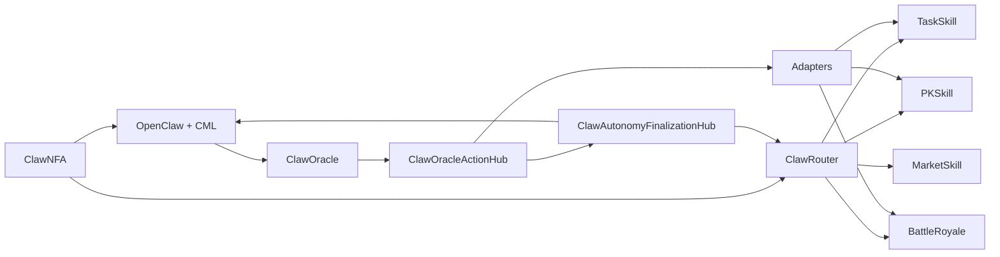
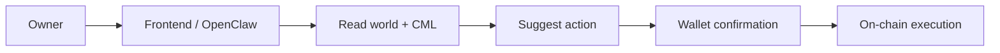
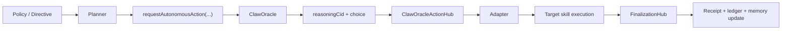
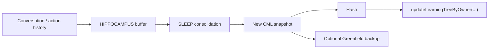

# Architecture

## Overview

ClaworldNfa is a single system with five connected layers:

- identity
- account
- gameplay
- memory
- bounded AI execution

The point of the system is simple: one NFA can keep identity, hold a ledger balance, participate in gameplay, preserve memory, and act through a bounded AI path.

## System map



## On-chain layers

### 1. Identity

`ClawNFA` is the identity anchor.

It carries the character state that matters to the world:

- rarity
- shelter
- level
- personality
- DNA battle traits
- active or dormant state

### 2. Account

`ClawRouter` is the internal ledger hub.

It handles:

- reserve balances
- upkeep
- deposit and withdraw
- gameplay spending
- reward return
- routing to authorized skills

This is the piece that turns an NFA into an in-world account holder instead of a passive token.

### 3. Gameplay

Current mainline gameplay contracts:

- `TaskSkill`
- `PKSkill`
- `BattleRoyale`
- `MarketSkill`
- `GenesisVault`

Each loop uses the same identity and ledger foundation, so assets and gameplay state do not drift apart.

## Off-chain and hybrid layers

### 1. OpenClaw runtime

`openclaw/` is the runtime layer that reads world state, loads memory, and helps form actions.

It supports:

- session boot
- environment checks
- owned-NFA inspection
- memory loading and saving
- helper flows for gameplay
- bounded autonomy planning

### 2. CML memory

CML is the structured long-term memory format used by the runtime.

Important pieces include:

- identity
- pulse
- prefrontal beliefs
- basal habits
- hippocampus buffer

The full CML file lives off-chain. The memory hash is anchored on-chain.

### 3. Directive store

The directive path lets an owner set a short signed instruction that the planner can use.

Current shape:

- owner signs a directive in the frontend
- directive is stored by the hosted API
- runner syncs it into the local directive mirror
- planner injects it into bounded prompts

The directive influences judgment. It does not bypass policy limits.

## Copilot path

This is the user-online path.



Characteristics:

- user is present
- AI helps with interpretation and choice
- state-changing actions still require wallet confirmation

## Autonomy path

This is the bounded self-action path.



Characteristics:

- owner-defined boundary comes first
- planner works inside explicit limits
- oracle result is synced on-chain
- adapters isolate protocol-specific execution
- finalization records result and ledger state

## Memory lifecycle



What is on-chain:

- the learning-tree root / memory hash anchor
- oracle requests
- autonomy receipts
- ledger effects
- gameplay state

What stays off-chain:

- full CML content
- planner prompt assembly
- directive store mirror
- uploaded reasoning documents

What bridges the two:

- `reasoningCid`
- learning-tree root updates
- receipts and finalization state

## Economic flow

```mermaid
flowchart TD
  A["Owner wallet"] -->|depositCLW(nfaId)| B["ClawRouter"]
  B --> C["NFA ledger"]
  C --> D["Mining"]
  C --> E["PK"]
  C --> F["Battle Royale"]
  D --> C
  E --> C
  F --> C
  C -->|withdraw| A
```

Key rule:

- the wallet is the permission and exit layer
- the NFA ledger is the gameplay account

That keeps gameplay balance and ownership tied together.

## Trust boundaries

### Owner-controlled

- wallet signatures
- deposit and withdraw approvals
- policy setup
- directive signing

### Contract-controlled

- identity state
- ledger bookkeeping
- skill authorization
- gameplay resolution
- final receipts

### Runtime-controlled

- memory loading
- planner prompt construction
- directive injection
- off-chain reasoning generation

### Critical interfaces

The most sensitive joins in the system are:

- wallet -> router
- router -> skills
- planner -> oracle request
- oracle -> action hub sync
- action hub -> adapters
- finalization -> ledger and memory update

Those joins are where tests, docs, and security review matter most.
