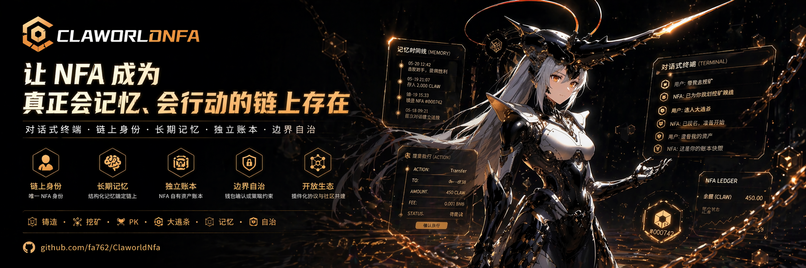
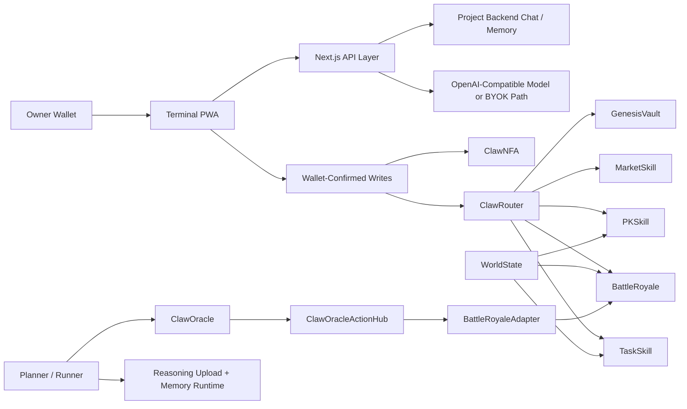
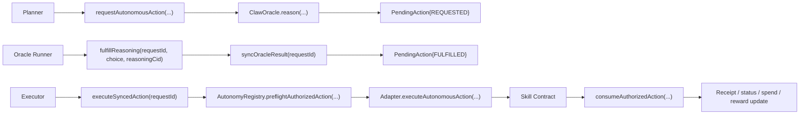
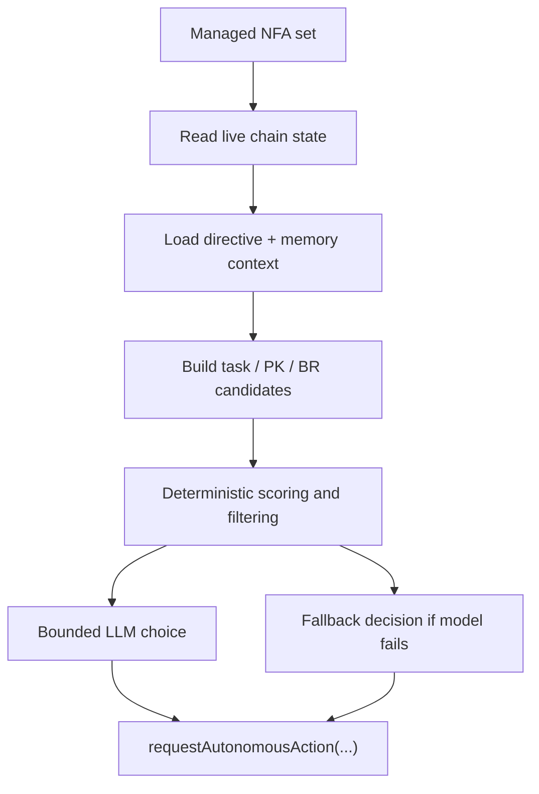
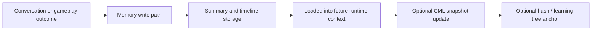
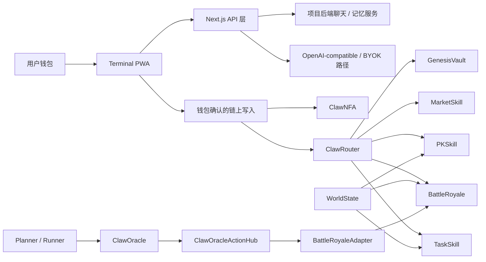
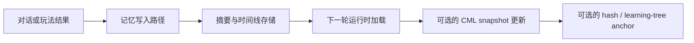

<p align="center">
  
</p>

# ClaworldNfa

Language: [English](#english) | [中文](#chinese)

ClaworldNfa is a live BNB Chain project that turns a Non-Fungible Agent into one coherent runtime subject: identity, ledger account, gameplay actor, memory carrier, chat surface, and bounded autonomous executor.

ClaworldNfa 是一个已经跑在 BNB Chain 主网上的项目。这里的 NFA 不是一张图，也不是一个聊天皮肤，而是同一个主体同时承担身份、账本账户、玩法角色、记忆载体、对话入口和有边界的自治执行。

- Live app: [www.clawnfaterminal.xyz](https://www.clawnfaterminal.xyz)
- Public repository: [github.com/fa762/ClaworldNfa](https://github.com/fa762/ClaworldNfa)
- Network: BNB Smart Chain mainnet
- Token name used in product UI: `Claworld`
- License: MIT

---

<a id="english"></a>
## English

### Executive Summary

ClaworldNfa is not a simple "AI + NFT" wrapper.

The engineering thesis is that one NFA can be all of these at once:

- an owned on-chain identity
- an in-world internal ledger account
- a playable game actor
- a memory-bearing companion
- a natural-language runtime endpoint
- a bounded autonomous executor

This repository contains the full stack for that model:

- 14 tracked Solidity source modules across core, skills, world, and adapter layers
- 12 Hardhat test suites
- a live Terminal-style PWA built with Next.js 16, React 19, wagmi, and viem
- server-side chat, memory, world, event, and autonomy API routes
- an `openclaw/` runtime with planner, runner, memory, tool, and watcher modules
- deployment, upgrade, smoke, and reveal-watch scripts for mainnet operation

The shortest description of the project is still this chain:

`NFA identity -> NFA ledger -> gameplay state -> memory context -> AI intent parsing -> action card -> wallet-confirmed or bounded autonomous execution -> receipt and accounting`

### Why This Repository Matters

Most projects split the important pieces apart:

- identity is one NFT
- balance is controlled somewhere else
- gameplay is disconnected from the identity layer
- memory is cosmetic or temporary
- AI can chat but cannot act safely
- autonomy, if present, is often just a signer with loose checks

ClaworldNfa takes the opposite route. It keeps identity, ledger, state, memory, gameplay, and bounded execution in one architecture.

### System Overview



### BAP-578 in ClaworldNfa

#### Identity

Source:

- `contracts/core/ClawNFA.sol`

What it contributes:

- the NFA token is the identity anchor
- visible state such as rarity, shelter, level, and progression lives on the protocol side
- the contract includes the learning-tree root path used to anchor evolving memory state

#### Account

Sources:

- `contracts/core/ClawRouter.sol`
- `contracts/core/DepositRouter.sol`

What they contribute:

- each NFA has its own internal Claworld ledger account
- gameplay spends and rewards resolve around that ledger
- the owner wallet becomes the permission and entry/exit layer
- the NFA ledger becomes the in-world operating account

#### Execution

Sources:

- `contracts/skills/TaskSkill.sol`
- `contracts/skills/PKSkill.sol`
- `contracts/skills/BattleRoyale.sol`
- `contracts/skills/MarketSkill.sol`
- `contracts/skills/GenesisVault.sol`
- `contracts/world/ClawOracle.sol`
- `contracts/world/ClawAutonomyRegistry.sol`
- `contracts/world/ClawOracleActionHub.sol`
- `contracts/world/adapters/BattleRoyaleAdapter.sol`

What they contribute:

- user-confirmed execution through the UI
- bounded offline execution through the autonomy stack
- gameplay that shares one identity and one ledger foundation

#### Learning

Sources:

- learning-tree path in `contracts/core/ClawNFA.sol`
- `frontend/src/app/api/memory/[tokenId]/summary/route.ts`
- `frontend/src/app/api/memory/[tokenId]/timeline/route.ts`
- `frontend/src/app/api/memory/[tokenId]/write/route.ts`
- `openclaw/cml.ts`
- `openclaw/autonomyCmlRuntime.ts`
- `openclaw/autonomyMemory.ts`

What they contribute:

- memory summary and memory timeline enter runtime context
- chat and autonomy can use memory as live state
- learning state can be anchored without dumping raw memory on-chain

### Contract Module Inventory

#### Core Contracts

| File | Role | What it is responsible for |
| --- | --- | --- |
| `contracts/core/ClawNFA.sol` | BAP-578 identity anchor | identity, rarity, shelter, level path, learning-tree root storage, visible NFA state |
| `contracts/core/ClawRouter.sol` | NFA ledger hub | balances, upkeep, dormancy, withdraw cooldown, gameplay dispatch, skill authorization |
| `contracts/core/DepositRouter.sol` | token ingress bridge | routes BNB into the CLW/Claworld path through bonding-curve or DEX routes |
| `contracts/core/PersonalityEngine.sol` | bounded personality evolution | monthly dimension caps, progression safeguards, personality shaping |

#### Skill Contracts

| File | Loop | Key mechanics |
| --- | --- | --- |
| `contracts/skills/GenesisVault.sol` | mint | commit-reveal, weighted rarity, reveal/refund flow, rescue paths for stuck commitments |
| `contracts/skills/TaskSkill.sol` | mining | task execution, XP and token rewarding, personality-weighted outcome path, world multiplier integration |
| `contracts/skills/PKSkill.sol` | arena | commit-reveal strategy game, strategy multipliers, mutation hooks, settlement |
| `contracts/skills/BattleRoyale.sol` | elimination tournament | room system, reveal window, emergency reveal path, NFA-ledger participation, autonomy-facing entry functions |
| `contracts/skills/MarketSkill.sol` | market | fixed price listings, auctions, NFA-for-NFA swaps, fee logic |

#### World and Autonomy Contracts

| File | Role | Key details |
| --- | --- | --- |
| `contracts/world/WorldState.sol` | global economy controller | reward multiplier, PK stake limit, mutation bonus, daily cost multiplier, event flags, timelocked changes |
| `contracts/world/ClawOracle.sol` | bounded reasoning request contract | `reason`, `fulfillReasoning`, `expireRequest`, one-hour request window |
| `contracts/world/ClawAutonomyRegistry.sol` | policy engine | checks approvals, budgets, reserve floors, limits, breakers, and dynamic reserve logic |
| `contracts/world/ClawOracleActionHub.sol` | action middle layer | stores pending autonomous actions, syncs oracle results, executes through adapters, emits receipts |
| `contracts/world/adapters/BattleRoyaleAdapter.sol` | execution isolation for Battle Royale | decodes hub payloads and calls the target skill inside a bounded adapter contract |

### Autonomy Policy Engine

If one module best represents the protocol-side originality of this repo, it is `contracts/world/ClawAutonomyRegistry.sol`.

This contract is not a switch. It is a full multi-dimensional policy engine.

The core functions are:

- `preflightAuthorizedAction(...)`
- `previewAuthorizedAction(...)`
- `consumeAuthorizedAction(...)`
- `_evaluateAction(...)`

The evaluation path checks multiple independent dimensions before an autonomous action can be consumed:

| Dimension | Why it exists |
| --- | --- |
| policy enabled | lets the owner shut the path off cleanly |
| emergency pause | global stop mechanism |
| operator approval | the runtime operator must still be explicitly approved |
| adapter approval | the execution adapter itself must be allowed |
| protocol approval | the target protocol/action family must be allowed |
| spend cap | constrains single-action spend |
| daily limit | constrains cumulative activity |
| failure breaker | stops repeated failing execution loops |
| operator budget | constrains the operator at a policy level |
| asset budget | constrains per-asset spend |
| reserve floor | protects minimum balance |
| dynamic reserve source | supports external reserve logic |
| dynamic reserve buffer | keeps reserve calculation adaptive instead of static |

The dynamic reserve path is especially important. A static reserve floor is easy to reason about, but it is often wrong in volatile conditions. ClawworldNfa supports a reserve-source hook plus `dynamicReserveBufferBps` so the safe minimum can adapt to external conditions while still staying on-chain and policy-bounded.

### Autonomous Action Lifecycle

The autonomy flow is explicit and auditable. It runs through `contracts/world/ClawOracleActionHub.sol`.



Key properties of this design:

- `capabilityHash` snapshots the policy state at request time
- the request carries bounded choices instead of open-ended execution
- `syncOracleResult` and `executeSyncedAction` are separated because policy may change between reasoning and execution
- adapters isolate protocol-specific execution
- receipts preserve a durable audit trail

Important receipt content includes:

- `requestId`
- `nfaId`
- `actionKind`
- `protocolId`
- `status`
- `resolvedChoice`
- `payloadHash`
- `capabilityHash`
- `resultHash`
- `receiptHash`
- `requestedSpend`
- `actualSpend`
- `clwCredit`
- `xpCredit`
- timestamps
- `retryCount`
- `reasoningCid`
- `lastError`

### Planner and Runner Design

The `openclaw/` runtime is where the AI model meets bounded execution.

Main files:

- `openclaw/autonomyPlanner.ts`
- `openclaw/autonomyOracleRunner.ts`
- `openclaw/autonomyTxPolicy.ts`
- `openclaw/autonomyCmlRuntime.ts`
- `openclaw/autonomyMemory.ts`
- `openclaw/reasoningUploader.ts`
- `openclaw/battleRoyaleRevealWatcher.ts`
- `openclaw/skills/*.ts`

#### Planner Method

The planner does **not** give the model a blank check.

Its method is:

1. enumerate managed NFAs
2. check cooldowns and policy readiness
3. prioritize maintenance work first, such as reveals or claims
4. build deterministic candidate sets for tasks, PK, and Battle Royale
5. score candidates deterministically
6. ask the LLM to choose among bounded options
7. fall back to hardcoded safety ranking if the model fails



#### Oracle Runner Method

The oracle runner:

1. watches `ReasoningRequested`
2. loads the request and choice context
3. loads memory context
4. assembles the bounded decision prompt
5. parses the chosen option back into a concrete bounded choice
6. builds a reasoning document
7. uploads the reasoning document when configured
8. fulfills the oracle request on-chain
9. syncs and executes the action hub lifecycle

### Memory and CML

The project uses a CML-style memory model so the NFA can carry continuity across sessions and actions.

Key runtime files:

- `openclaw/cml.ts`
- `openclaw/autonomyCmlRuntime.ts`
- `openclaw/autonomyMemory.ts`
- `frontend/src/lib/terminal-memory-local.ts`

Key API routes:

- `frontend/src/app/api/memory/[tokenId]/summary/route.ts`
- `frontend/src/app/api/memory/[tokenId]/timeline/route.ts`
- `frontend/src/app/api/memory/[tokenId]/write/route.ts`

Memory lifecycle:



Important point:

- the full memory body does not have to live on-chain
- the runtime still supports verifiable anchoring through the learning-tree path
- memory is treated as runtime state, not decorative lore

### Terminal PWA and Frontend Architecture

The live product surface is a Terminal-style PWA. That is the mainline product today.

Primary UI modules:

- `frontend/src/components/terminal/TerminalHome.tsx`
- `frontend/src/components/terminal/TerminalActionPanel.tsx`
- `frontend/src/components/terminal/TerminalFinancePanel.tsx`
- `frontend/src/components/terminal/TerminalMarketPanel.tsx`
- `frontend/src/components/terminal/TerminalMemoryPanel.tsx`
- `frontend/src/components/terminal/TerminalSettingsPanel.tsx`

Primary data hooks:

- `frontend/src/components/terminal/useTerminalChatHistory.ts`
- `frontend/src/components/terminal/useTerminalLocalChat.ts`
- `frontend/src/components/terminal/useTerminalAutonomy.ts`
- `frontend/src/components/terminal/useTerminalMemory.ts`
- `frontend/src/components/terminal/useTerminalNfas.ts`
- `frontend/src/components/terminal/useTerminalWorld.ts`
- `frontend/src/components/terminal/useTerminalEvents.ts`

Primary server routes:

| Route group | Files | Purpose |
| --- | --- | --- |
| chat | `frontend/src/app/api/chat/[tokenId]/history/route.ts`, `frontend/src/app/api/chat/[tokenId]/send/route.ts` | conversation history, intent parsing, reply generation, action-card generation |
| memory | `frontend/src/app/api/memory/[tokenId]/summary/route.ts`, `timeline`, `write` | memory summary, recent timeline, write path |
| autonomy | `frontend/src/app/api/autonomy/directive/route.ts`, `frontend/src/app/api/autonomy/[tokenId]/status/route.ts` | directive submission and runtime status |
| NFA data | `frontend/src/app/api/nfas/route.ts`, `frontend/src/app/api/nfas/[tokenId]/route.ts`, `frontend/src/app/api/agents/[id]/route.ts` | owned NFA loading and detail aggregation |
| world and events | `frontend/src/app/api/world/summary/route.ts`, `frontend/src/app/api/events/stream/route.ts` | world state and live event stream |
| support | `frontend/src/app/api/pk/auto-reveal/route.ts`, `frontend/src/app/api/game-assets/[asset]/route.ts` | relay and asset helpers |

Important frontend libraries:

- `frontend/src/app/api/_lib/backend-chat.ts`
- `frontend/src/app/api/_lib/direct-llm.ts`
- `frontend/src/app/api/_lib/terminal-chat.ts`
- `frontend/src/app/api/_lib/chain-queries.ts`
- `frontend/src/lib/terminal-cards.ts`
- `frontend/src/lib/chat-engine.tsx`
- `frontend/src/lib/i18n.tsx`

Secondary surfaces still present in the repository:

- page routes under `frontend/src/app/` for companion, arena, auto, mint, guide, lore, settings, NFA pages, and other earlier UI paths
- a Phaser-based game surface under `frontend/src/game/`
- an `openclaw/claw-world-skill/` package and Hermes-compatible tool files

### World Economy and Token Ingress

`contracts/world/WorldState.sol` controls global gameplay modifiers such as reward multiplier, PK stake limit, mutation bonus, daily cost multiplier, and event phases.

`contracts/core/DepositRouter.sol` is where the repo directly touches the external token ingress path. It supports:

- `Flap Portal` / bonding-curve routing before graduation
- PancakeSwap routing after graduation

That matters because the project economy is not pretending its token comes from nowhere. The ingress path is wired into the contract layer.

### Source Tree

The tree below focuses on tracked engineering source and docs. It intentionally omits `node_modules`, caches, build artifacts, local logs, and temporary working folders.

```text
ClaworldNfa/
├── contracts/
│   ├── core/
│   │   ├── ClawNFA.sol                         # BAP-578 identity anchor + learning-tree root
│   │   ├── ClawRouter.sol                      # NFA ledger hub, upkeep, authorized dispatch
│   │   ├── DepositRouter.sol                   # BNB -> CLW ingress via Flap Portal or Pancake
│   │   └── PersonalityEngine.sol               # monthly-bounded personality evolution
│   ├── interfaces/
│   │   ├── IClawRouter.sol
│   │   ├── IDepositRouter.sol
│   │   ├── IFlapPortal.sol
│   │   ├── IPancakeRouter.sol
│   │   └── IPersonalityEngine.sol
│   ├── mocks/
│   │   ├── MockAutonomyNFA.sol
│   │   ├── MockAutonomyRouter.sol
│   │   ├── MockCLW.sol
│   │   ├── MockFlapPortal.sol
│   │   ├── MockPancakePair.sol
│   │   └── MockPancakeRouter.sol
│   ├── skills/
│   │   ├── BattleRoyale.sol
│   │   ├── GenesisVault.sol
│   │   ├── MarketSkill.sol
│   │   ├── PKSkill.sol
│   │   └── TaskSkill.sol
│   └── world/
│       ├── adapters/
│       │   └── BattleRoyaleAdapter.sol
│       ├── interfaces/
│       │   ├── IClawActionAdapter.sol
│       │   └── IClawAutonomyDelegationRegistryView.sol
│       ├── ClawAutonomyRegistry.sol
│       ├── ClawOracle.sol
│       ├── ClawOracleActionHub.sol
│       └── WorldState.sol
├── docs/
│   ├── assets/
│   │   └── banner.png
│   └── INNOVATION_MAP.md
├── frontend/
│   ├── package.json
│   └── src/
│       ├── app/
│       │   ├── page.tsx
│       │   ├── globals.css
│       │   ├── layout.tsx
│       │   ├── manifest.ts
│       │   ├── api/
│       │   ├── arena/
│       │   ├── auto/
│       │   ├── companion/
│       │   ├── game/
│       │   ├── guide/
│       │   ├── lore/
│       │   ├── mint/
│       │   ├── nfa/
│       │   ├── openclaw/
│       │   ├── play/
│       │   └── settings/
│       ├── components/
│       │   ├── auto/
│       │   ├── game/
│       │   ├── home/
│       │   ├── layout/
│       │   ├── lobster/
│       │   ├── mint/
│       │   ├── nfa/
│       │   ├── terminal/
│       │   └── wallet/
│       ├── contracts/
│       │   ├── addresses.ts
│       │   ├── abis/
│       │   └── hooks/
│       ├── game/
│       └── lib/
├── openclaw/
│   ├── autonomyCmlRuntime.ts
│   ├── autonomyMemory.ts
│   ├── autonomyOracleRunner.ts
│   ├── autonomyPlanner.ts
│   ├── autonomyTxPolicy.ts
│   ├── battleRoyaleRevealWatcher.ts
│   ├── cml.ts
│   ├── reasoningUploader.ts
│   ├── skills/
│   └── claw-world-skill/
├── scripts/
│   ├── deploy-phase1.ts
│   ├── deploy-phase2.ts
│   ├── deploy-phase3.ts
│   ├── deploy-and-upgrade-all.ts
│   ├── configure-deposit-router.ts
│   ├── smoke-battle-royale-autonomy-mainnet.ts
│   ├── watch-battle-royale-reveal.ts
│   ├── upgrade-battle-royale.ts
│   ├── upgrade-taskskill-mainnet.ts
│   ├── upgrade-router-clw.ts
│   ├── force-refund-stuck-commit.ts
│   └── ...
├── test/
│   ├── BattleRoyale.test.ts
│   ├── BattleRoyaleAutonomy.test.ts
│   ├── ClawNFA.test.ts
│   ├── ClawRouter.test.ts
│   ├── DepositRouter.test.ts
│   ├── GenesisVault.test.ts
│   ├── Integration.test.ts
│   ├── MarketSkill.test.ts
│   ├── PersonalityEngine.test.ts
│   ├── PKSkill.test.ts
│   ├── TaskSkill.test.ts
│   └── WorldState.test.ts
├── ARCHITECTURE.md
├── CHANGELOG.md
├── CONTRIBUTING.md
├── Dockerfile.autonomy-runner
├── LICENSE
├── PROJECT.md
├── SECURITY.md
├── hardhat.config.ts
├── package.json
└── tsconfig.openclaw.json
```

### Mainnet Addresses

Canonical mainnet defaults are kept in `frontend/src/contracts/addresses.ts`.

| Module | Address | Notes |
| --- | --- | --- |
| ClawNFA | `0xAa2094798B5892191124eae9D77E337544FFAE48` | identity |
| ClawRouter | `0x60C0D5276c007Fd151f2A615c315cb364EF81BD5` | NFA ledger hub |
| WorldState | `0xC375E0a2f4e06cF79b4571AB4d2f6118482b9FCA` | global gameplay parameters |
| GenesisVault | `0xCe04f834aC4581FD5562f6c58C276E60C624fF83` | mint |
| Claworld token | `0x3b486c191c74c9945fa944a3ddde24acdd63ffff` | product token |
| Flap Portal | `0x3525e9B10cD054E7A32248902EB158c863F3a18B` | pre-graduation ingress |
| Pancake Router | `0x114E4c57754c69dAA360a8894698F1D832E56350` | post-graduation ingress |
| TaskSkill | `0xaed370784536e31BE4A5D0Dbb1bF275c98179D10` | mining |
| PKSkill | `0xA58e9E0D5f3970d46c9779a9A127DdAc60508dfF` | PK |
| MarketSkill | `0x6e3d89B36a7f396143Ff123e8a40F66FE2382a54` | market |
| DepositRouter | `0xFe68460e9C55AB188b1E91fd4dB4D7219Bd3f269` | BNB -> Clawworld path |
| PersonalityEngine | `0x19E8A11d8b6E94230f0C174f6Fc4Ca11e6f4331E` | progression bounds |
| BattleRoyale | `0x2B2182326Fd659156B2B119034A72D1C2cC9758D` | BR |
| AutonomyRegistry | `0xD18BaF2670fFcb4CC92260719AbFc9d637dB7044` | policy engine |
| AutonomyDelegationRegistry | `0x1C3A69fC7715563D9dDF9847BB5ffF3B6e09aAEa` | delegation support |
| OracleActionHub | `0xEdd04D821ab9E8eCD5723189A615333c3509f1D5` | action hub |
| AutonomyFinalizationHub | `0x65F850536bE1B844c407418d8FbaE795045061bd` | runtime-integrated deployment address |
| WorldEventSkill | `0xdD1273990234D591c098e1E029876F0236Ef8bD3` | world-event surface |
| TaskSkillAdapter | `0xe7a7E66F9F05eC14925B155C4261F32603857E8E` | adapter |
| PKSkillAdapter | `0x1ef409114BAD145e5289a5e906E9Ea38B7d05A0c` | adapter |
| BattleRoyaleAdapter | `0xCD71fD0429DC82EfD6Ef019a7e1F7f93a5A1AEcc` | adapter |
| Autonomy operator | `0x567f863A3dB5CBaf59796F6524b1b3ca1793911C` | runtime operator |

### Local Development

#### Root

```bash
npm install
npm run compile
npm test
```

#### Frontend

```bash
npm --prefix frontend install
npm --prefix frontend run dev
npm --prefix frontend run build
```

#### Autonomy runner checks

```bash
npm run runner:autonomy:check
npm run watch:battle-royale:check
```

#### Useful script families

- deploy: `scripts/deploy-phase*.ts`, `scripts/deploy-and-upgrade-all.ts`
- upgrade: `scripts/upgrade-*.ts`
- diagnostics and repair: `scripts/check-permissions.ts`, `scripts/fix-permissions.ts`, `scripts/force-refund-stuck-commit.ts`
- autonomy smoke: `scripts/smoke-battle-royale-autonomy-mainnet.ts`
- reveal watcher: `scripts/watch-battle-royale-reveal.ts`

### Environment Variables

Examples live in:

- `.env.example`
- `openclaw/.env.autonomy-runner.example`
- `frontend/.env.example`

Important deployment variables include:

| Variable | Purpose |
| --- | --- |
| `CLAWORLD_API_URL` | backend API base |
| `CLAWORLD_API_TOKEN` | backend auth token |
| `CLAWORLD_CHAT_MODEL_BASE_URL` | server-side model endpoint |
| `CLAWORLD_CHAT_MODEL_API_KEY` | server-side model key |
| `CLAWORLD_CHAT_MODEL_NAME` | active model name |
| `CLAWORLD_ENABLE_WEB_TOOLS` | enable web search/tool path in supported deployments |
| `NEXT_PUBLIC_CHAIN_ID` | BSC mainnet or testnet |
| `NEXT_PUBLIC_RPC_URL` | frontend RPC endpoint |
| `NEXT_PUBLIC_WALLETCONNECT_PROJECT_ID` | walletconnect client config |
| `AUTONOMY_*` variables in `openclaw/.env.autonomy-runner.example` | autonomy operator, hub, oracle, memory, and reasoning-upload config |

Do not commit live keys, live private keys, WalletConnect secrets, operator wallets, or backend-only tokens.

### Security Model

#### Wallet boundary

- user-initiated writes are wallet confirmed
- the browser does not hold project-side private keys

#### Protocol boundary

- skills spend only through authorized paths
- autonomy goes through registry checks, oracle choice syncing, and adapters
- commit-reveal mechanics are used where game design needs them

#### Runtime boundary

- memory loading happens off-chain
- reasoning documents can be uploaded off-chain and referenced by CID
- BYOK settings stay local and are encrypted client-side

#### Operational boundary

- world parameter changes are timelocked
- reserve and budget controls exist in the autonomy policy layer
- failure breakers and reserve floors exist to stop unsafe repeated execution

For vulnerability reporting and disclosure expectations, see `SECURITY.md`.

### Reviewer Reading Path

If you want to understand the project as an engineering system rather than a product demo, read in this order:

1. `PROJECT.md`
2. `ARCHITECTURE.md`
3. `docs/INNOVATION_MAP.md`
4. `contracts/core/ClawRouter.sol`
5. `contracts/world/ClawAutonomyRegistry.sol`
6. `contracts/world/ClawOracleActionHub.sol`
7. `contracts/skills/BattleRoyale.sol`
8. `contracts/skills/PKSkill.sol`
9. `openclaw/autonomyPlanner.ts`
10. `openclaw/autonomyOracleRunner.ts`
11. `frontend/src/app/api/chat/[tokenId]/send/route.ts`
12. `frontend/src/components/terminal/TerminalHome.tsx`

### What Is in the Public Repo and What Is Not

The public repository includes:

- protocol contracts
- runtime code
- frontend code
- script paths
- docs
- tests

The public repository does not include:

- hosted secrets
- live production API keys
- private operator wallets
- private infrastructure credentials
- personal runbooks or transient operations notes

---

<a id="chinese"></a>
## 中文

### 项目定位

ClaworldNfa 不是一个“AI 聊天壳 + NFT 图片”的项目。

它真正要做的是：让同一个 NFA 同时成为下面这些东西：

- 链上身份
- NFA 自己的记账账户
- 玩法里的真实角色
- 带记忆的伙伴
- 自然语言交互入口
- 有边界的自治执行主体

最短的一句话就是这条链：

`NFA 身份 -> NFA 账本 -> 游戏状态 -> 记忆上下文 -> AI 理解意图 -> 动作卡 -> 钱包确认 / 有边界自治执行 -> 回执与记账`

### 为什么这个仓库重要

很多项目把关键层拆散了：

- 身份是一张 NFT
- 资产在别的地方
- 玩法和身份层分离
- 记忆只是装饰
- AI 能聊天，但不能安全执行
- 自治如果存在，常常只是一个权限很大的 signer

ClaworldNfa 做的事情正好相反：把身份、账本、状态、记忆、玩法和有边界的执行放到一套体系里。

### 总体系统图



### BAP-578 在 ClaworldNfa 里的实现

#### 身份

来源：

- `contracts/core/ClawNFA.sol`

作用：

- NFA 本身就是身份锚点
- 等级、稀有度、避难所、成长状态这些都在协议层
- learning-tree root 这条链上锚定路径也在这里

#### 账户

来源：

- `contracts/core/ClawRouter.sol`
- `contracts/core/DepositRouter.sol`

作用：

- 每只 NFA 有自己的内部 Clawworld 账本
- 玩法消耗和奖励围绕这个账本结算
- 钱包负责权限和进出
- NFA 账本负责世界内的运作

#### 执行

来源：

- `contracts/skills/TaskSkill.sol`
- `contracts/skills/PKSkill.sol`
- `contracts/skills/BattleRoyale.sol`
- `contracts/skills/MarketSkill.sol`
- `contracts/skills/GenesisVault.sol`
- `contracts/world/ClawOracle.sol`
- `contracts/world/ClawAutonomyRegistry.sol`
- `contracts/world/ClawOracleActionHub.sol`
- `contracts/world/adapters/BattleRoyaleAdapter.sol`

作用：

- 用户在线时走钱包确认
- 用户离线时走有边界的 autonomy path
- 所有玩法共享同一套身份和账本基础

#### 学习

来源：

- `contracts/core/ClawNFA.sol` 里的 learning-tree 路径
- `frontend/src/app/api/memory/[tokenId]/summary/route.ts`
- `frontend/src/app/api/memory/[tokenId]/timeline/route.ts`
- `frontend/src/app/api/memory/[tokenId]/write/route.ts`
- `openclaw/cml.ts`
- `openclaw/autonomyCmlRuntime.ts`
- `openclaw/autonomyMemory.ts`

作用：

- 记忆摘要和时间线进入运行时上下文
- 对话和自治都可以用这些上下文
- 记忆可以链下保留主体内容，同时保留链上锚定能力

### 合约模块清单

#### Core

| 文件 | 作用 |
| --- | --- |
| `contracts/core/ClawNFA.sol` | BAP-578 身份锚点、learning-tree root、角色可见状态 |
| `contracts/core/ClawRouter.sol` | NFA 账本、维护费、休眠、提现冷却、授权 skill 分发 |
| `contracts/core/DepositRouter.sol` | BNB -> Clawworld 资金入口 |
| `contracts/core/PersonalityEngine.sol` | 五维性格成长与月度边界 |

#### Skills

| 文件 | 作用 |
| --- | --- |
| `contracts/skills/GenesisVault.sol` | commit-reveal 铸造、揭示、退款 |
| `contracts/skills/TaskSkill.sol` | 挖矿任务、奖励、XP、性格匹配 |
| `contracts/skills/PKSkill.sol` | PK 策略 commit-reveal、对战结算、DNA 变化 |
| `contracts/skills/BattleRoyale.sol` | 房间制大逃杀、揭示窗口、NFA 账本入场、自主接口 |
| `contracts/skills/MarketSkill.sol` | 固定价、拍卖、互换 |

#### World / Autonomy

| 文件 | 作用 |
| --- | --- |
| `contracts/world/WorldState.sol` | 世界参数、事件、倍率、timelock |
| `contracts/world/ClawOracle.sol` | bounded choice 的链上推理请求 |
| `contracts/world/ClawAutonomyRegistry.sol` | 多维 policy engine |
| `contracts/world/ClawOracleActionHub.sol` | request / sync / execute 生命周期与回执 |
| `contracts/world/adapters/BattleRoyaleAdapter.sol` | ActionHub 到玩法执行的隔离层 |

### AutonomyRegistry 和 ActionHub

`contracts/world/ClawAutonomyRegistry.sol` 不是简单白名单，而是策略引擎。它会检查：

- policy 开关
- emergency pause
- operator / adapter / protocol approval
- spend cap
- daily limit
- failure breaker
- operator budget
- asset budget
- reserve floor
- dynamic reserve source 和 buffer

关键函数：

- `preflightAuthorizedAction(...)`
- `previewAuthorizedAction(...)`
- `consumeAuthorizedAction(...)`
- `_evaluateAction(...)`

`contracts/world/ClawOracleActionHub.sol` 负责把自治动作拆成明确生命周期：

1. `requestAutonomousAction(...)`
2. `syncOracleResult(...)`
3. `executeSyncedAction(...)`
4. receipt / result update

关键设计：

- `capabilityHash` 绑定动作发起时的策略快照
- `reasoningCid` 连接推理文档
- payload、result、receipt 都有哈希
- spend、奖励、重试次数、错误信息都进入回执

### openclaw runtime

关键文件：

- `openclaw/autonomyPlanner.ts`
- `openclaw/autonomyOracleRunner.ts`
- `openclaw/autonomyTxPolicy.ts`
- `openclaw/autonomyCmlRuntime.ts`
- `openclaw/autonomyMemory.ts`
- `openclaw/reasoningUploader.ts`
- `openclaw/battleRoyaleRevealWatcher.ts`

方法论：

1. 先读取链上状态、世界状态、记忆、directive
2. 先由确定性代码生成候选
3. 先由确定性代码打分
4. 再让 LLM 在 bounded options 里选
5. 模型失败时走 fallback

### 记忆与 CML

这个项目不是把记忆当作聊天气氛组，而是把记忆当作运行时状态。

关键文件：

- `openclaw/cml.ts`
- `openclaw/autonomyCmlRuntime.ts`
- `openclaw/autonomyMemory.ts`
- `frontend/src/lib/terminal-memory-local.ts`

关键 API 路由：

- `frontend/src/app/api/memory/[tokenId]/summary/route.ts`
- `frontend/src/app/api/memory/[tokenId]/timeline/route.ts`
- `frontend/src/app/api/memory/[tokenId]/write/route.ts`

记忆链路可以概括成：



关键点：

- 完整记忆正文不必直接上链
- 运行时仍然可以读取记忆摘要与时间线
- learning-tree 路径保留了可验证锚定空间
- 记忆是运行时状态，不是装饰 lore

### 前端与对话路径

主产品面是 Terminal PWA。

关键组件：

- `frontend/src/components/terminal/TerminalHome.tsx`
- `frontend/src/components/terminal/TerminalActionPanel.tsx`
- `frontend/src/components/terminal/TerminalFinancePanel.tsx`
- `frontend/src/components/terminal/TerminalMarketPanel.tsx`
- `frontend/src/components/terminal/TerminalMemoryPanel.tsx`
- `frontend/src/components/terminal/TerminalSettingsPanel.tsx`

关键服务端路由：

- chat: `frontend/src/app/api/chat/[tokenId]/...`
- memory: `frontend/src/app/api/memory/[tokenId]/...`
- autonomy: `frontend/src/app/api/autonomy/...`
- nfas: `frontend/src/app/api/nfas/...`
- world: `frontend/src/app/api/world/summary/route.ts`
- events: `frontend/src/app/api/events/stream/route.ts`

仓库里也还保留了其他工程面：

- `frontend/src/game/` 下的 Phaser 路径
- `frontend/src/app/arena/`、`auto/`、`mint/`、`nfa/` 等页面
- `openclaw/claw-world-skill/` 下的 skill / hermes 工具面

### 世界经济与代币入口

`contracts/world/WorldState.sol` 负责全局玩法参数，比如：

- reward multiplier
- PK stake limit
- mutation bonus
- daily cost multiplier
- event phases

`contracts/core/DepositRouter.sol` 则是真实代币入口。它支持：

- 毕业前走 `Flap Portal` / bonding curve
- 毕业后走 PancakeSwap

这意味着：

- 代币入口
- 世界参数
- 玩法经济

是在同一套系统里联动设计的。

### 文件结构树

下面这个结构树聚焦真实工程源码，刻意省略了 `node_modules`、缓存、构建产物、临时日志和本地工作目录。

```text
ClaworldNfa/
├── contracts/
│   ├── core/
│   │   ├── ClawNFA.sol
│   │   ├── ClawRouter.sol
│   │   ├── DepositRouter.sol
│   │   └── PersonalityEngine.sol
│   ├── interfaces/
│   ├── mocks/
│   ├── skills/
│   │   ├── BattleRoyale.sol
│   │   ├── GenesisVault.sol
│   │   ├── MarketSkill.sol
│   │   ├── PKSkill.sol
│   │   └── TaskSkill.sol
│   └── world/
│       ├── adapters/
│       │   └── BattleRoyaleAdapter.sol
│       ├── interfaces/
│       ├── ClawAutonomyRegistry.sol
│       ├── ClawOracle.sol
│       ├── ClawOracleActionHub.sol
│       └── WorldState.sol
├── docs/
│   ├── assets/
│   └── INNOVATION_MAP.md
├── frontend/
│   └── src/
│       ├── app/
│       │   ├── api/
│       │   ├── arena/
│       │   ├── auto/
│       │   ├── companion/
│       │   ├── game/
│       │   ├── mint/
│       │   ├── nfa/
│       │   ├── openclaw/
│       │   ├── play/
│       │   └── settings/
│       ├── components/
│       │   ├── auto/
│       │   ├── game/
│       │   ├── layout/
│       │   ├── lobster/
│       │   ├── nfa/
│       │   ├── terminal/
│       │   └── wallet/
│       ├── contracts/
│       │   ├── addresses.ts
│       │   ├── abis/
│       │   └── hooks/
│       ├── game/
│       └── lib/
├── openclaw/
│   ├── autonomyPlanner.ts
│   ├── autonomyOracleRunner.ts
│   ├── autonomyCmlRuntime.ts
│   ├── autonomyMemory.ts
│   ├── autonomyTxPolicy.ts
│   ├── battleRoyaleRevealWatcher.ts
│   ├── reasoningUploader.ts
│   ├── skills/
│   └── claw-world-skill/
├── scripts/
│   ├── deploy-phase1.ts
│   ├── deploy-phase2.ts
│   ├── deploy-phase3.ts
│   ├── deploy-and-upgrade-all.ts
│   ├── smoke-battle-royale-autonomy-mainnet.ts
│   ├── watch-battle-royale-reveal.ts
│   └── upgrade-*.ts
├── test/
│   ├── BattleRoyale.test.ts
│   ├── BattleRoyaleAutonomy.test.ts
│   ├── ClawNFA.test.ts
│   ├── ClawRouter.test.ts
│   ├── DepositRouter.test.ts
│   ├── GenesisVault.test.ts
│   ├── Integration.test.ts
│   ├── MarketSkill.test.ts
│   ├── PersonalityEngine.test.ts
│   ├── PKSkill.test.ts
│   ├── TaskSkill.test.ts
│   └── WorldState.test.ts
├── ARCHITECTURE.md
├── CHANGELOG.md
├── CONTRIBUTING.md
├── PROJECT.md
├── LICENSE
└── SECURITY.md
```

### 主网地址与开发

主网默认地址来自 `frontend/src/contracts/addresses.ts`。

| 模块 | 地址 | 说明 |
| --- | --- | --- |
| ClawNFA | `0xAa2094798B5892191124eae9D77E337544FFAE48` | 身份层 |
| ClawRouter | `0x60C0D5276c007Fd151f2A615c315cb364EF81BD5` | NFA 账本枢纽 |
| WorldState | `0xC375E0a2f4e06cF79b4571AB4d2f6118482b9FCA` | 世界参数 |
| GenesisVault | `0xCe04f834aC4581FD5562f6c58C276E60C624fF83` | 铸造 |
| Clawworld token | `0x3b486c191c74c9945fa944a3ddde24acdd63ffff` | 基础代币 |
| Flap Portal | `0x3525e9B10cD054E7A32248902EB158c863F3a18B` | bonding-curve 路径 |
| Pancake Router | `0x114E4c57754c69dAA360a8894698F1D832E56350` | DEX 路径 |
| TaskSkill | `0xaed370784536e31BE4A5D0Dbb1bF275c98179D10` | 挖矿 |
| PKSkill | `0xA58e9E0D5f3970d46c9779a9A127DdAc60508dfF` | PK |
| MarketSkill | `0x6e3d89B36a7f396143Ff123e8a40F66FE2382a54` | 市场 |
| DepositRouter | `0xFe68460e9C55AB188b1E91fd4dB4D7219Bd3f269` | 充值入口 |
| PersonalityEngine | `0x19E8A11d8b6E94230f0C174f6Fc4Ca11e6f4331E` | 性格成长 |
| BattleRoyale | `0x2B2182326Fd659156B2B119034A72D1C2cC9758D` | 大逃杀 |
| AutonomyRegistry | `0xD18BaF2670fFcb4CC92260719AbFc9d637dB7044` | policy engine |
| AutonomyDelegationRegistry | `0x1C3A69fC7715563D9dDF9847BB5ffF3B6e09aAEa` | delegation |
| OracleActionHub | `0xEdd04D821ab9E8eCD5723189A615333c3509f1D5` | 动作中枢 |
| AutonomyFinalizationHub | `0x65F850536bE1B844c407418d8FbaE795045061bd` | finalization 地址 |
| WorldEventSkill | `0xdD1273990234D591c098e1E029876F0236Ef8bD3` | 世界事件能力 |
| TaskSkillAdapter | `0xe7a7E66F9F05eC14925B155C4261F32603857E8E` | adapter |
| PKSkillAdapter | `0x1ef409114BAD145e5289a5e906E9Ea38B7d05A0c` | adapter |
| BattleRoyaleAdapter | `0xCD71fD0429DC82EfD6Ef019a7e1F7f93a5A1AEcc` | adapter |
| Autonomy operator | `0x567f863A3dB5CBaf59796F6524b1b3ca1793911C` | runtime operator |

本地开发常用命令：

```bash
npm install
npm run compile
npm test

npm --prefix frontend install
npm --prefix frontend run dev
npm --prefix frontend run build

npm run runner:autonomy:check
npm run watch:battle-royale:check
```

### 环境变量

示例文件：

- `.env.example`
- `frontend/.env.example`
- `openclaw/.env.autonomy-runner.example`

重要变量：

- `CLAWORLD_API_URL`
- `CLAWORLD_API_TOKEN`
- `CLAWORLD_CHAT_MODEL_BASE_URL`
- `CLAWORLD_CHAT_MODEL_API_KEY`
- `CLAWORLD_CHAT_MODEL_NAME`
- `CLAWORLD_ENABLE_WEB_TOOLS`
- `NEXT_PUBLIC_CHAIN_ID`
- `NEXT_PUBLIC_RPC_URL`
- `NEXT_PUBLIC_WALLETCONNECT_PROJECT_ID`
- `AUTONOMY_*` 系列变量

### 安全边界

- 用户写操作必须钱包确认
- 浏览器不拿项目端私钥
- skill 只能走授权路径
- 自治必须经过 policy engine、oracle、hub、adapter
- BYOK 密钥本地加密保存
- 世界参数变更要经过 timelock

详细说明请看 `SECURITY.md`。

### 建议阅读顺序

1. `PROJECT.md`
2. `ARCHITECTURE.md`
3. `docs/INNOVATION_MAP.md`
4. `contracts/core/ClawRouter.sol`
5. `contracts/world/ClawAutonomyRegistry.sol`
6. `contracts/world/ClawOracleActionHub.sol`
7. `contracts/skills/BattleRoyale.sol`
8. `contracts/skills/PKSkill.sol`
9. `openclaw/autonomyPlanner.ts`
10. `openclaw/autonomyOracleRunner.ts`
11. `frontend/src/app/api/chat/[tokenId]/send/route.ts`
12. `frontend/src/components/terminal/TerminalHome.tsx`

### 开源仓库包含什么，不包含什么

公开仓库里有：

- 合约源码
- runtime 源码
- 前端源码
- 脚本
- 测试
- 文档

公开仓库里没有：

- 线上 secrets
- 生产 API keys
- 私有 operator 钱包
- 私有基础设施凭据
- 个人运维笔记
