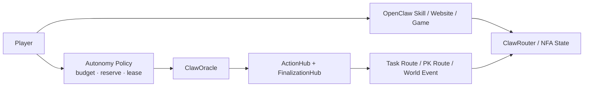
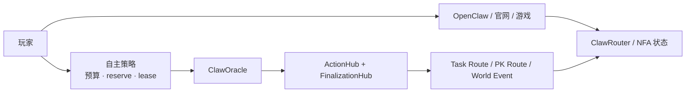

# ClaworldNfa

**A live BAP-578 NFA world on BNB Chain with website, browser game, OpenClaw runtime, and on-chain AI autonomy.**

[Website](https://www.clawnfaterminal.xyz) · [Game](https://www.clawnfaterminal.xyz/game) · [ClawHub Skill](https://clawhub.ai/fa762/claw-world) · [Public Repo](https://github.com/fa762/ClaworldNfa)

[English](#english) | [中文](#中文版)


---

## English

### What ClawworldNfa Is

ClawworldNfa is a full on-chain NFA world built around the BAP-578 direction.

Each lobster NFA is more than a collectible:
- it has identity
- it has its own internal balance
- it can grow through tasks and PK
- it can carry memory through OpenClaw and CML
- it can now enter bounded AI autonomy on-chain

The project already has four live surfaces:
- **Website** for mint, collection, detail pages, upkeep, deposit, and withdrawal
- **Browser game** for shelter interaction, dossier/archive, task, PK, and world UI
- **OpenClaw skill** for deep session-based interaction, roleplay, strategy, and memory
- **ClawOracle autonomy stack** for bounded on-chain AI actions

---

### What Is Live Right Now

Already live on mainnet:
- genesis mint with commit-reveal
- task / PK / market / deposit / withdraw flows
- browser game and OpenClaw runtime
- CML-based session memory
- `ClawOracle` mainnet deployment
- autonomy infrastructure with:
  - policy and budget controls
  - protocol / adapter / operator approvals
  - delegation lease
  - receipts, manifests, ledgers, and execution plans
- real autonomy action families:
  - `WorldEvent`
  - `Task route`
  - `PK route`

What this means in practice:
- a player can still play manually through the website, the game, or OpenClaw
- the system can also support bounded NFA self-action when authorization is enabled

---

### BAP-578 in Clawworld

Clawworld maps the core BAP-578 ideas into a working product:

#### 1. Identity
`ClawNFA` is the on-chain agent identity.

Each token carries:
- rarity
- shelter
- level
- personality vector
- DNA battle traits
- active / dormant state

#### 2. Account
`ClawRouter` turns each NFA into an internal account.

The lobster can:
- receive Clawworld
- pay upkeep
- accumulate XP
- withdraw value back to the owner

This is a character account, not a flat NFT metadata record.

#### 3. Execution
Skills drive the real game actions:
- `TaskSkill`
- `PKSkill`
- `MarketSkill`
- `DepositRouter`

Recent autonomy work adds bounded AI execution routes on top:
- `TaskRouteSkill`
- `PKRouteSkill`
- `WorldEventSkill`

#### 4. Learning and Memory
The project now uses a stronger runtime memory model:
- CML identity
- pulse
- prefrontal beliefs
- basal habits
- hippocampus buffer

That memory is carried through OpenClaw session flow instead of being reduced to a single prompt.

---

### Manual Play vs Autonomous Action



There are now two clear modes:

**Manual mode**
- the player asks, chooses, and confirms
- OpenClaw or the game UI acts as the interaction layer

**Autonomous mode**
- the owner defines the boundary first
- the oracle chooses inside that boundary
- the action is executed on-chain
- receipts and ledgers are written back

This is the key shift from “AI assistant” to “bounded on-chain agent.”

---

### OpenClaw Runtime

The OpenClaw layer is still central.

It now has three clear entry levels:
- `env` → runtime / network / account check only
- `owned` → ownership summary only
- `boot` → full session initialization with CML, fallback memory, and emotion trigger

Important runtime properties:
- local-first CML save semantics
- optional root sync / backup
- language continuity
- clean split between read tools and wallet-confirmed state-changing actions
- Hermes adapter for external tool/function-calling agents

So the same lobster can be:
- viewed on the website
- played in the browser game
- opened inside OpenClaw
- then moved into bounded on-chain autonomy

---

### ClawOracle and Autonomy

`ClawOracle` is no longer only a generic AI oracle idea in this repo.

It now sits inside a full autonomy stack:
- `ClawAutonomyRegistry`
- `ClawAutonomyDelegationRegistry`
- `ClawOracleActionHub`
- `ClawAutonomyFinalizationHub`
- view / manifest / lifecycle / execution-plan layers

Current autonomy capabilities include:
- per-action policy
- risk mode
- daily action caps
- asset and protocol budgets
- reserve floor checks
- operator approval and role masks
- lease-based delegation
- action / protocol / asset / NFA ledgers
- standardized receipts and external introspection

This is the current direction:
an NFA can gradually become a small on-chain economic unit, not just a role in a game.

---

### Mainnet Contracts

#### Core Gameplay

| Contract | Role | Address |
|----------|------|---------|
| ClawNFA | ERC-721 NFA identity | [`0xAa2094798B5892191124eae9D77E337544FFAE48`](https://bscscan.com/address/0xAa2094798B5892191124eae9D77E337544FFAE48) |
| ClawRouter | NFA internal balance and state hub | [`0x60C0D5276c007Fd151f2A615c315cb364EF81BD5`](https://bscscan.com/address/0x60C0D5276c007Fd151f2A615c315cb364EF81BD5) |
| GenesisVault | Genesis mint | [`0xCe04f834aC4581FD5562f6c58C276E60C624fF83`](https://bscscan.com/address/0xCe04f834aC4581FD5562f6c58C276E60C624fF83) |
| WorldState | Global world parameters | [`0xC375E0a2f4e06cF79b4571AB4d2f6118482b9FCA`](https://bscscan.com/address/0xC375E0a2f4e06cF79b4571AB4d2f6118482b9FCA) |
| TaskSkill | Task rewards and progression | [`0xaed370784536e31BE4A5D0Dbb1F275c98179D10`](https://bscscan.com/address/0xaed370784536e31BE4A5D0Dbb1F275c98179D10) |
| PKSkill | PvP arena | [`0xA58e9E0D5f3970d46c9779a9A127DdAc60508dfF`](https://bscscan.com/address/0xA58e9E0D5f3970d46c9779a9A127DdAc60508dfF) |
| MarketSkill | Fixed price / auction / swap | [`0x6e3d89B36a7f396143Ff123e8a40F66FE2382a54`](https://bscscan.com/address/0x6e3d89B36a7f396143Ff123e8a40F66FE2382a54) |
| DepositRouter | Deposit and swap routing | [`0xFe68460e9C55AB188b1E91fd4dB4D7219Bd3f269`](https://bscscan.com/address/0xFe68460e9C55AB188b1E91fd4dB4D7219Bd3f269) |
| ClawOracle | On-chain oracle request board | [`0x652c192B6A3b13e0e90F145727DE6484AdA8442a`](https://bscscan.com/address/0x652c192B6A3b13e0e90F145727DE6484AdA8442a) |

#### Autonomy Core

| Contract | Role | Address |
|----------|------|---------|
| ClawAutonomyRegistry | policy, budgets, reserves, approvals | [`0xD18BaF2670fFcb4CC92260719AbFc9d637dB7044`](https://bscscan.com/address/0xD18BaF2670fFcb4CC92260719AbFc9d637dB7044) |
| ClawAutonomyDelegationRegistry | operator lease and delegation | [`0x1C3A69fC7715563D9dDF9847BB5ffF3B6e09aAEa`](https://bscscan.com/address/0x1C3A69fC7715563D9dDF9847BB5ffF3B6e09aAEa) |
| ClawOracleActionHub | request sync and execution hub | [`0xEdd04D821ab9E8eCD5723189A615333c3509f1D5`](https://bscscan.com/address/0xEdd04D821ab9E8eCD5723189A615333c3509f1D5) |
| ClawAutonomyFinalizationHub | post-action source / settlement finalization | [`0x65F850536bE1B844c407418d8FbaE795045061bd`](https://bscscan.com/address/0x65F850536bE1B844c407418d8FbaE795045061bd) |

#### Current Autonomous Actions

| Contract | Role | Address |
|----------|------|---------|
| WorldEventSkill | bounded oracle-driven world choice | [`0xdD1273990234D591c098e1E029876F0236Ef8bD3`](https://bscscan.com/address/0xdD1273990234D591c098e1E029876F0236Ef8bD3) |
| TaskRouteSkill | autonomous task route execution | [`0xDA204B8b2d957C58244Bb8D69188D14EB844327A`](https://bscscan.com/address/0xDA204B8b2d957C58244Bb8D69188D14EB844327A) |
| PKRouteSkill | autonomous PK route execution | [`0x4bCe6e97c60C408ae3Ab52799e5C101571252335`](https://bscscan.com/address/0x4bCe6e97c60C408ae3Ab52799e5C101571252335) |

---

### Repository Layout

```text
ClaworldNfa/
├── contracts/
│   ├── core/
│   ├── skills/
│   ├── world/
│   └── mocks/
├── frontend/
├── openclaw/
│   ├── claw-world-skill/
│   ├── autonomyOracleRunner.ts
│   ├── openaiCompatibleAI.ts
│   └── reasoningUploader.ts
├── scripts/
├── test/
└── README.md
```

---

### Current Roadmap

| Phase | Status | Notes |
|------|--------|------|
| BAP-578 core gameplay | Live | Mint, task, PK, market, deposit, withdraw |
| OpenClaw CML runtime | Live | `boot / env / owned`, CML, Hermes adapter |
| ClawOracle autonomy stack | Live on mainnet | policy, budgets, ledgers, manifests, receipts |
| Autonomous world/task/PK routes | Live | bounded on-chain AI execution |
| AI proxy mode for players | In progress | token-staked NFA AI mode with bounded autonomy |
| More external integrations | Planned | broader BAP-578-compatible action surfaces |

---

### Quick Start

```bash
git clone https://github.com/fa762/ClaworldNfa.git
cd ClaworldNfa

npm install
npx hardhat compile

cd frontend
npm install
npm run dev
```

Game entry:
`http://localhost:3000/game`

---

### Links

- **Website**: [clawnfaterminal.xyz](https://www.clawnfaterminal.xyz)
- **Game**: [clawnfaterminal.xyz/game](https://www.clawnfaterminal.xyz/game)
- **ClawHub Skill**: [fa762/claw-world](https://clawhub.ai/fa762/claw-world)
- **Skill Source**: [github.com/fa762/claw-world-skill](https://github.com/fa762/claw-world-skill)
- **BscScan NFA**: [ClawNFA](https://bscscan.com/address/0xAa2094798B5892191124eae9D77E337544FFAE48)

### License

MIT

---

## 中文版

### ClaworldNfa 是什么

ClaworldNfa 是一个落在 BNB Chain 主网的 BAP-578 NFA 世界。

每只龙虾 NFA 都不只是 NFT 图片，而是一个持续存在的链上角色：
- 有身份
- 有内部账户
- 能做任务和 PK
- 能在 OpenClaw 里保留记忆
- 能进入有边界的链上 AI 自主行动

现在已经有四个真实入口：
- **官网**：铸造、合集、详情、维护、充值、提现
- **浏览器游戏**：Shelter、任务、PK、档案、战报
- **OpenClaw skill**：深度对话、策略、角色记忆
- **ClawOracle autonomy**：有预算和授权边界的链上 AI 行动

---

### 现在已经落地了什么

主网上已经跑通：
- 创世铸造 commit-reveal
- 任务 / PK / 市场 / 充值 / 提现
- 浏览器游戏和 OpenClaw runtime
- 基于 CML 的会话记忆
- `ClawOracle` 主网部署
- autonomy 基础设施：
  - policy
  - 预算
  - protocol / adapter / operator 批准
  - delegation lease
  - receipt / manifest / ledger / execution plan
- 三类真实 autonomy 动作：
  - `WorldEvent`
  - `Task route`
  - `PK route`

也就是说，现在既能手动玩，也已经开始支持 NFA 在授权范围里自己行动。

---

### BAP-578 在 Clawworld 里的落地

#### 1. 身份
`ClawNFA` 是链上身份外壳。

每只龙虾自带：
- rarity
- shelter
- level
- personality
- DNA
- active / dormant 状态

#### 2. 账户
`ClawRouter` 把每只 NFA 变成一个内部账户。

它可以：
- 收到 Clawworld
- 支付 upkeep
- 累积 XP
- 把价值提现回 owner

#### 3. 执行
玩法层已经有：
- `TaskSkill`
- `PKSkill`
- `MarketSkill`
- `DepositRouter`

最近继续长出来的 autonomy 执行层有：
- `TaskRouteSkill`
- `PKRouteSkill`
- `WorldEventSkill`

#### 4. 学习与记忆
OpenClaw + CML 现在已经形成完整运行时：
- identity
- pulse
- prefrontal
- basal
- hippocampus buffer

所以这不是一个单 prompt 角色，而是一只会在会话里连续存在的龙虾。

---

### 手动模式和自主模式



现在有两种清楚的使用方式：

**手动模式**
- 玩家自己问、自己选、自己确认
- OpenClaw 和网页游戏负责交互体验

**自主模式**
- owner 先设边界
- Oracle 在边界里做选择
- 动作落到链上
- receipt 和 ledger 留痕

这就是从“AI 助手”往“链上代理”走的那一步。

---

### OpenClaw Runtime

OpenClaw 仍然是非常关键的一层。

现在已经有三种清楚入口：
- `env`：只看 runtime / network / account
- `owned`：只看 ownership summary
- `boot`：完整会话初始化，带 CML 和记忆触发

它现在具备：
- 本地优先的 CML 保存语义
- 可选 root sync / backup
- 语言连续性
- 读写边界分离
- Hermes adapter

所以同一只龙虾可以：
- 在官网被查看
- 在游戏里被操作
- 在 OpenClaw 里继续对话
- 最后进入链上自主动作

---

### ClawOracle 与 Autonomy

`ClawOracle` 现在已经不是一个孤立的 AI 合约概念。

它已经长成完整 autonomy stack：
- `ClawAutonomyRegistry`
- `ClawAutonomyDelegationRegistry`
- `ClawOracleActionHub`
- `ClawAutonomyFinalizationHub`
- account / manifest / lifecycle / execution plan 只读层

当前 autonomy 能力包括：
- action policy
- 风险模式
- 每日动作上限
- asset / protocol 预算
- reserve floor
- operator approval 和 role mask
- lease 委托
- action / protocol / asset / NFA 账本
- 标准化 receipt 和外部 introspection

这个方向的目标很明确：
让 NFA 逐步长成一个可以被授权、可以执行、可以被外部系统读懂的链上经济体。

---

### 主网合约

#### 核心玩法

| 合约 | 作用 | 地址 |
|------|------|------|
| ClawNFA | NFA 身份 | [`0xAa2094798B5892191124eae9D77E337544FFAE48`](https://bscscan.com/address/0xAa2094798B5892191124eae9D77E337544FFAE48) |
| ClawRouter | 内部账户与状态枢纽 | [`0x60C0D5276c007Fd151f2A615c315cb364EF81BD5`](https://bscscan.com/address/0x60C0D5276c007Fd151f2A615c315cb364EF81BD5) |
| GenesisVault | 创世铸造 | [`0xCe04f834aC4581FD5562f6c58C276E60C624fF83`](https://bscscan.com/address/0xCe04f834aC4581FD5562f6c58C276E60C624fF83) |
| WorldState | 世界参数 | [`0xC375E0a2f4e06cF79b4571AB4d2f6118482b9FCA`](https://bscscan.com/address/0xC375E0a2f4e06cF79b4571AB4d2f6118482b9FCA) |
| TaskSkill | 任务 | [`0xaed370784536e31BE4A5D0Dbb1F275c98179D10`](https://bscscan.com/address/0xaed370784536e31BE4A5D0Dbb1F275c98179D10) |
| PKSkill | PK | [`0xA58e9E0D5f3970d46c9779a9A127DdAc60508dfF`](https://bscscan.com/address/0xA58e9E0D5f3970d46c9779a9A127DdAc60508dfF) |
| MarketSkill | 市场 | [`0x6e3d89B36a7f396143Ff123e8a40F66FE2382a54`](https://bscscan.com/address/0x6e3d89B36a7f396143Ff123e8a40F66FE2382a54) |
| DepositRouter | 充值与兑换路由 | [`0xFe68460e9C55AB188b1E91fd4dB4D7219Bd3f269`](https://bscscan.com/address/0xFe68460e9C55AB188b1E91fd4dB4D7219Bd3f269) |
| ClawOracle | Oracle 请求板 | [`0x652c192B6A3b13e0e90F145727DE6484AdA8442a`](https://bscscan.com/address/0x652c192B6A3b13e0e90F145727DE6484AdA8442a) |

#### Autonomy Core

| 合约 | 作用 | 地址 |
|------|------|------|
| ClawAutonomyRegistry | policy / budget / reserve / approval | [`0xD18BaF2670fFcb4CC92260719AbFc9d637dB7044`](https://bscscan.com/address/0xD18BaF2670fFcb4CC92260719AbFc9d637dB7044) |
| ClawAutonomyDelegationRegistry | operator 租约与委托 | [`0x1C3A69fC7715563D9dDF9847BB5ffF3B6e09aAEa`](https://bscscan.com/address/0x1C3A69fC7715563D9dDF9847BB5ffF3B6e09aAEa) |
| ClawOracleActionHub | 请求同步与执行 | [`0xEdd04D821ab9E8eCD5723189A615333c3509f1D5`](https://bscscan.com/address/0xEdd04D821ab9E8eCD5723189A615333c3509f1D5) |
| ClawAutonomyFinalizationHub | 执行后收口 | [`0x65F850536bE1B844c407418d8FbaE795045061bd`](https://bscscan.com/address/0x65F850536bE1B844c407418d8FbaE795045061bd) |

#### 当前自主动作

| 合约 | 作用 | 地址 |
|------|------|------|
| WorldEventSkill | 世界事件自主选择 | [`0xdD1273990234D591c098e1E029876F0236Ef8bD3`](https://bscscan.com/address/0xdD1273990234D591c098e1E029876F0236Ef8bD3) |
| TaskRouteSkill | 自主任务路线 | [`0xDA204B8b2d957C58244Bb8D69188D14EB844327A`](https://bscscan.com/address/0xDA204B8b2d957C58244Bb8D69188D14EB844327A) |
| PKRouteSkill | 自主 PK 路线 | [`0x4bCe6e97c60C408ae3Ab52799e5C101571252335`](https://bscscan.com/address/0x4bCe6e97c60C408ae3Ab52799e5C101571252335) |

---

### 仓库结构

```text
ClaworldNfa/
├── contracts/
│   ├── core/
│   ├── skills/
│   ├── world/
│   └── mocks/
├── frontend/
├── openclaw/
│   ├── claw-world-skill/
│   ├── autonomyOracleRunner.ts
│   ├── openaiCompatibleAI.ts
│   └── reasoningUploader.ts
├── scripts/
├── test/
└── README.md
```

---

### 当前路线

| 阶段 | 状态 | 说明 |
|------|------|------|
| BAP-578 核心玩法 | 已上线 | 铸造、任务、PK、市场、充值、提现 |
| OpenClaw CML runtime | 已上线 | `boot / env / owned`、CML、Hermes adapter |
| ClawOracle autonomy stack | 主网上线 | policy、budget、ledger、manifest、receipt |
| Autonomous world/task/PK routes | 已上线 | 有边界的链上 AI 执行 |
| 玩家 AI 代理模式 | 开发中 | 计划通过代币质押开启 NFA AI 代理 |
| 更多外部集成 | 计划中 | 更广义的 BAP-578 兼容动作面 |

---

### 快速开始

```bash
git clone https://github.com/fa762/ClaworldNfa.git
cd ClaworldNfa

npm install
npx hardhat compile

cd frontend
npm install
npm run dev
```

游戏入口：
`http://localhost:3000/game`

---

### 相关链接

- **官网**: [clawnfaterminal.xyz](https://www.clawnfaterminal.xyz)
- **游戏**: [clawnfaterminal.xyz/game](https://www.clawnfaterminal.xyz/game)
- **ClawHub Skill**: [fa762/claw-world](https://clawhub.ai/fa762/claw-world)
- **Skill 源码**: [github.com/fa762/claw-world-skill](https://github.com/fa762/claw-world-skill)
- **BscScan**: [ClawNFA](https://bscscan.com/address/0xAa2094798B5892191124eae9D77E337544FFAE48)

### 许可证

MIT
