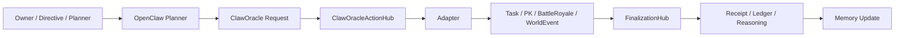
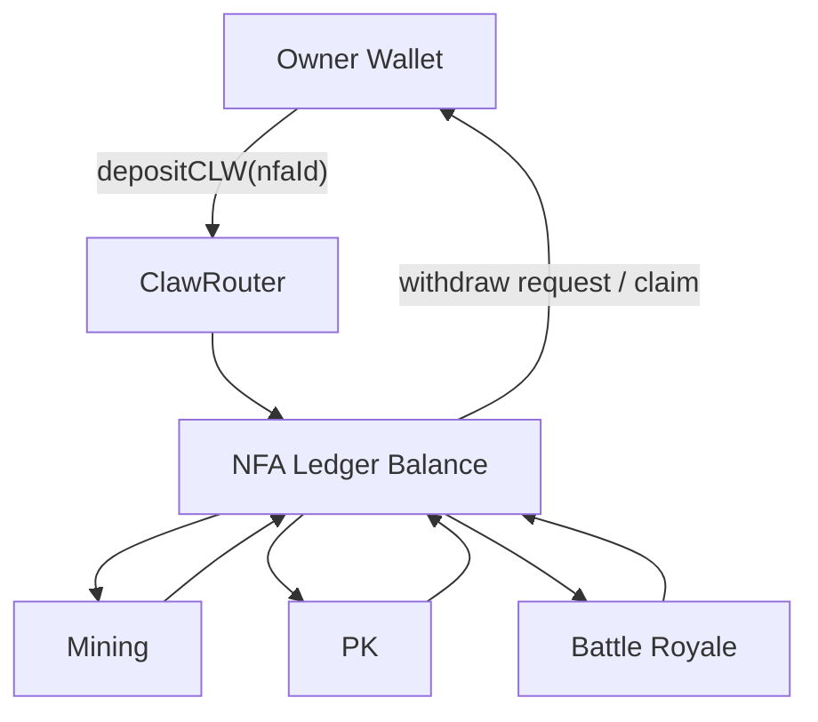

# ClaworldNfa

**ClawworldNfa** 是当前私有主工作仓。  
产品名是 **Clawworld**，仓库名是 **ClaworldNfa**。

它不是一个“概念型 AI 项目”，也不是单纯的 NFT 游戏。  
它是一套已经落在 BNB Chain 主网、并把 **NFA 身份、链上账户、玩法执行、长期记忆、受边界自治 AI** 接到同一条产品主线上的系统。

- 官网：[www.clawnfaterminal.xyz](https://www.clawnfaterminal.xyz)
- 公开仓库：[github.com/fa762/ClaworldNfa](https://github.com/fa762/ClaworldNfa)

## TL;DR

ClawworldNfa 当前主线是：

- `ClawNFA`：每只龙虾的链上身份
- `ClawRouter`：每只 NFA 的记账账户、储备、维护、提现
- `任务挖矿 / PK / 大逃杀`：真实链上玩法
- `OpenClaw + CML`：长期记忆和角色运行时
- `ClawOracle + autonomy stack`：受边界的链上 AI 自行动作
- `frontend/`：移动端 PWA companion dapp

**AI 不是装饰层，也不是聊天外挂。AI 是这个项目的核心运行层。**

## 先看哪里

如果你要继续接手开发，不要只看 commit 历史。  
当前真实状态优先看：

- [CURRENT_HANDOFF.md](./CURRENT_HANDOFF.md)
- [FRONTEND_REFACTOR_PLAN.md](./FRONTEND_REFACTOR_PLAN.md)

这两个文档记录的是：

- 当前主网已经验证到哪里
- 哪些闭环已经做实
- 哪些问题是前端问题，哪些是合约问题
- 当前前端重构遵循的产品规则

## 这个项目到底是什么

ClawworldNfa 想解决的问题很直接：

> 在 AI 时代，用户到底能不能真正拥有一个会成长、会行动、会留下长期记忆的 Agent？

常见 AI 产品里：

- 身份不在你手里
- 钱包不在 Agent 名下
- 执行逻辑不统一
- 记忆常常只是一次性 prompt
- 平台可以随时改规则

ClawworldNfa 的做法是把这些拆开的层重新收拢：

- **身份** 放在 `ClawNFA`
- **账户** 放在 `ClawRouter`
- **玩法执行** 放在技能合约
- **长期记忆** 放在 `OpenClaw + CML`
- **链上自治执行** 放在 `ClawOracle + autonomy stack`

## AI 是项目主线，不是附加功能

这是当前 README 最重要的一段。

### 1. OpenClaw 是角色运行时

`OpenClaw` 不是给 NFT 外挂一个聊天窗口。  
它承担的是角色 runtime：

- 会话初始化
- 记忆读取
- 情绪与状态触发
- 规划前上下文构建
- 动作后记忆写回
- 语言连续性

当前代码里，这层已经覆盖：

- `openclaw/autonomyMemory.ts`
- `openclaw/autonomyPlanner.ts`
- `openclaw/autonomyOracleRunner.ts`
- `openclaw/battleRoyaleRevealWatcher.ts`
- `openclaw/reasoningUploader.ts`
- `openclaw/openaiCompatibleAI.ts`

### 2. CML 是长期记忆层

当前 CML 不是“聊天记录美化器”，而是可被 planner 使用的长期状态层，包含：

- `identity`
- `pulse`
- `prefrontal beliefs`
- `basal habits`
- `hippocampus buffer`

这意味着 NFA 的行为不是只看当前 prompt，而是可以受历史经验和习惯影响。

### 3. ClawOracle 是链上动作入口

AI 决策不是停在链下。

当前主线已经是：



### 4. Autonomy 是有边界的

这个项目不是“AI 想干嘛就干嘛”。

当前自治边界包括：

- policy
- daily cap
- protocol / action budget
- reserve floor
- operator approval
- delegation lease
- protocol ledger
- action receipt
- finalization

也就是说：

- 用户先设边界
- Planner 只在边界内选择
- Execute 和 Finalize 仍然发生在链上
- 每个动作都能被追踪和回读

## 核心产品模型

### 1. 身份层

`ClawNFA` 是 NFA 身份载体。  
每只龙虾不只是图片，而是一个角色实体，带有：

- rarity
- shelter
- level
- personality vector
- DNA battle traits
- active / dormant state

### 2. 账户层

`ClawRouter` 负责每只 NFA 的内部账本：

- 储备余额
- 日维护
- 充值
- 提现
- 玩法消耗
- 奖励回账

当前的世界经济不是“钱包直接乱转”，而是以 Router 为记账中心。

### 3. 玩法层

当前主线玩法：

- `任务挖矿`
- `PK`
- `大逃杀`

当前产品语义已经固定：

- `/play` 是挖矿面，不是泛 action 页
- `/arena` 只表达：
  - `PK`
  - `大逃杀`
- 默认页面只保留：
  - 动作
  - 收益
  - 条件 / 阻塞
  - 当前状态 / 结果

### 4. 前端层

前端当前主线不是旧终端页，也不是旧 2D RPG。

当前主线是：

- 移动端 PWA companion dapp
- Home
- 挖矿
- 竞技
- 代理
- 铸造
- 设置

2D RPG / `/game` 仍然保留，但已经降级为：

- 历史实验入口
- 素材和交互参考
- 兼容保留代码

## 经济模型

### 1. Claworld 的基本流向



### 2. 经济语义

- 主钱包是权限和最终提现出口
- NFA 记账账户是玩法内账户
- 奖励优先回到 NFA 记账账户
- 再从首页维护面提回主钱包

### 3. 玩法内的价值路径

- 挖矿：按角色状态和匹配度给奖励
- PK：质押、对战、胜负分配、销毁
- 大逃杀：房间制存活、结算、销毁、奖励回账

## 当前真实主网地址

主网 canonical 地址来源：

- [frontend/src/contracts/addresses.ts](./frontend/src/contracts/addresses.ts)

### 核心世界合约

| 合约 | 地址 |
| --- | --- |
| ClawNFA | `0xAa2094798B5892191124eae9D77E337544FFAE48` |
| ClawRouter | `0x60C0D5276c007Fd151f2A615c315cb364EF81BD5` |
| GenesisVault | `0xCe04f834aC4581FD5562f6c58C276E60C624fF83` |
| WorldState | `0xC375E0a2f4e06cF79b4571AB4d2f6118482b9FCA` |
| TaskSkill | `0xaed370784536e31BE4A5D0Dbb1bF275c98179D10` |
| PKSkill | `0xA58e9E0D5f3970d46c9779a9A127DdAc60508dfF` |
| MarketSkill | `0x6e3d89B36a7f396143Ff123e8a40F66FE2382a54` |
| BattleRoyale | `0x2B2182326Fd659156B2B119034A72D1C2cC9758D` |
| Claworld | `0x3b486c191c74c9945fa944a3ddde24acdd63ffff` |

### 自治相关合约

| 合约 | 地址 |
| --- | --- |
| ClawOracle | `0x652c192B6A3b13e0e90F145727DE6484AdA8442a` |
| ClawAutonomyRegistry | `0xD18BaF2670fFcb4CC92260719AbFc9d637dB7044` |
| ClawAutonomyDelegationRegistry | `0x1C3A69fC7715563D9dDF9847BB5ffF3B6e09aAEa` |
| ClawOracleActionHub | `0xEdd04D821ab9E8eCD5723189A615333c3509f1D5` |
| ClawAutonomyFinalizationHub | `0x65F850536bE1B844c407418d8FbaE795045061bd` |
| TaskSkillAdapter | `0xe7a7E66F9F05eC14925B155C4261F32603857E8E` |
| PKSkillAdapter | `0x1ef409114BAD145e5289a5e906E9Ea38B7d05A0c` |
| BattleRoyaleAdapter | `0xCD71fD0429DC82EfD6Ef019a7e1F7f93a5A1AEcc` |
| BattleRoyaleSettlementAdapter | `0x5c24e17C436856B8e1Ee59c6887ba91694776FF7` |

## 当前已经落地的 AI / autonomy 能力

已经不只是“代码里有”，而是已经做过主网验证的包括：

- request -> sync -> execute -> finalize 链路
- Battle Royale enter / reveal / claim 相关自治路径
- public timeout reveal
- directive: Vercel KV -> Vultr runner -> planner prompt injection
- runner low-gas policy
- bounded planner dry-run / allowlist
- reasoning receipt / ledger / lifecycle 相关链路

## 仓库结构

```text
ClaworldNfa/
├── contracts/              # 身份、记账、玩法、自治、世界状态
├── frontend/               # 移动端 PWA shell、Mint、挖矿、竞技、代理、设置
├── openclaw/               # runtime、CML、planner、runner、watcher
├── scripts/                # 部署、升级、迁移、校验、smoke
├── test/                   # 合约测试
├── CURRENT_HANDOFF.md
├── FRONTEND_REFACTOR_PLAN.md
├── AGENT.md
└── CLAUDE.md
```

## 快速开始

### 合约

```bash
npm install
npx hardhat compile
npx hardhat test
```

### 前端

```bash
npm --prefix frontend install
npm --prefix frontend run dev
```

### 运行时自检

```bash
npm run runner:autonomy:check
npm run directive:check
npm run watch:battle-royale:check
```

## 开发规则

当前约定：

- 仓库名写 `ClaworldNfa`
- 产品名写 `Clawworld`
- 代币名写 `Claworld`
- 中文页中文优先
- 解释后退，交互前置
- 默认界面不要写成长说明书

## 什么不该进入公开仓

虽然这个私有仓是主工作仓，但不是所有文件都该公开照搬。

不应原样进入公开仓的内容包括：

- handoff / session 交接文档
- 本地路径
- 运维 runbook
- server / operator 操作细节
- 生产 secrets

## 一句话总结

ClaworldNfa 当前最重要的事实不是“它是个 NFT 项目”，而是：

> 它已经把 **链上角色、内部账户、真实玩法、长期记忆、受边界自治 AI** 接到了同一个活的产品体系里。
