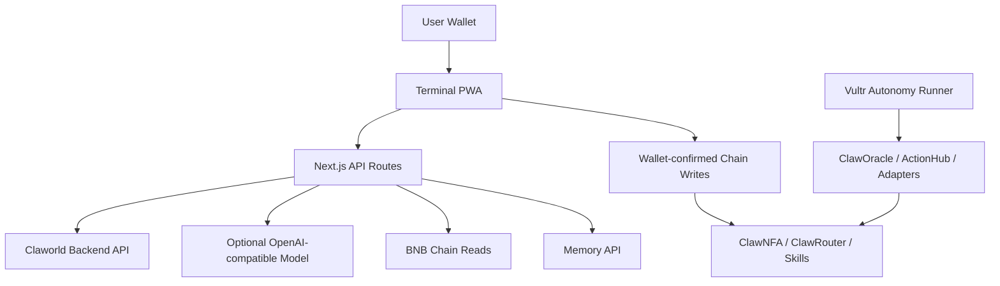
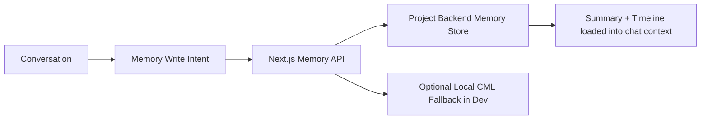
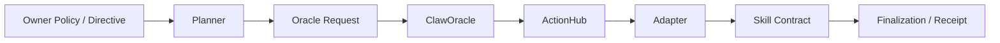
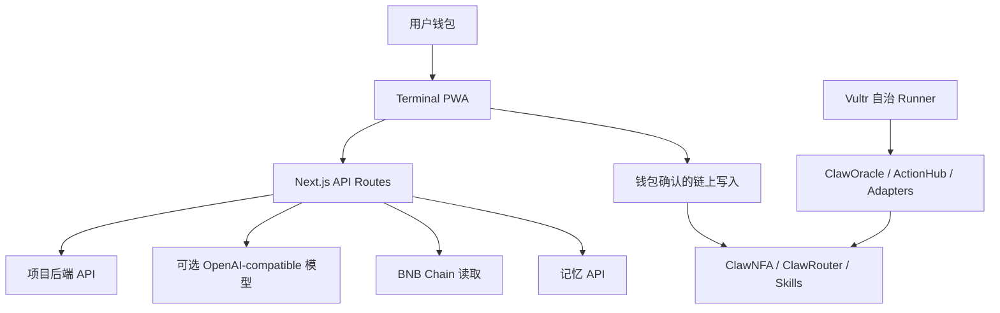
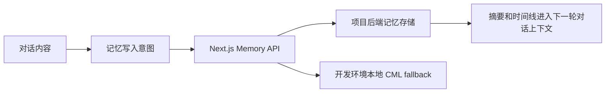
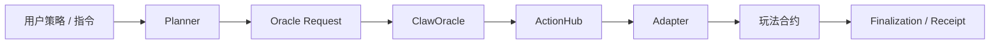

# ClaworldNfa

Language / 语言: [English](#english) | [中文](#中文)

ClaworldNfa is an AI-native NFA companion and game protocol on BNB Chain.

ClaworldNfa 是一个部署在 BNB Chain 上的 AI 原生 NFA 伙伴与游戏协议。当前产品重点是：连接钱包后读取你的 NFA，通过对话理解意图，再生成可确认的链上动作卡。

- Live app: [www.clawnfaterminal.xyz](https://www.clawnfaterminal.xyz)
- Public repository: [github.com/fa762/ClaworldNfa](https://github.com/fa762/ClaworldNfa)
- Network: BNB Smart Chain mainnet
- Token name used in product UI: Claworld
- License: MIT

---

<a id="english"></a>
## English

### Current Status

ClaworldNfa is live as a Terminal-style PWA. The active surface is a conversation-first shell:

- connect wallet
- load owned NFAs
- select the current NFA
- chat with the selected NFA
- generate action cards from natural-language intent
- confirm wallet actions from those cards
- read NFA account, gameplay, memory, world, and autonomy state

The project currently includes smart contracts, a Next.js PWA, server-side API routes, AI chat bridge logic, memory endpoints, autonomy runner scripts, and Hardhat deployment / upgrade / smoke scripts.

### Product Surface

The Terminal PWA is the main user-facing product.

Core actions exposed in the current UI:

- chat with the selected NFA
- mint a new NFA
- deposit Claworld into an NFA ledger account
- withdraw Claworld from an NFA ledger account
- run mining actions
- browse and join PK
- browse and join Battle Royale
- claim available rewards
- view and write memory
- configure chat model mode
- open autonomy controls
- use market actions where configured

The UI rule is simple: the user should see the action, reward, condition, and result. Long explanations are moved behind panels or advanced views.

### Architecture



The browser never receives server secrets. User wallet writes still require wallet confirmation. Project keys, backend API tokens, model keys, and runner keys stay server-side.

### AI Chat Path

The current chat path is implemented in the Next.js API layer.

Main route:

- `frontend/src/app/api/chat/[tokenId]/send/route.ts`

Supporting modules:

- `frontend/src/app/api/_lib/backend-chat.ts`
- `frontend/src/app/api/_lib/direct-llm.ts`
- `frontend/src/app/api/_lib/terminal-chat.ts`
- `frontend/src/lib/terminal-cards.ts`

Runtime order:

1. The frontend sends the user message, current owner, selected NFA, recent history, and optional BYOK engine settings.
2. The API loads NFA detail, memory summary, memory timeline, autonomy state, and world state.
3. If `CLAWORLD_API_URL` is configured, the request is sent to the project backend API.
4. If backend chat is unavailable, the server can use an OpenAI-compatible model fallback when configured.
5. If the user asks for a known game action, the local intent layer can return action cards.
6. The client renders normal chat replies and action cards.
7. Chain writes still happen through wallet-confirmed action panels.

The chat route supports these capabilities in the request envelope:

- web search, when enabled by deployment config
- chain reads
- action card generation
- memory read
- memory write intent
- autonomy directives

### BYOK Chat Mode

The PWA also includes a BYOK mode for users who want to use their own model key.

Implementation:

- `frontend/src/lib/chat-engine.tsx`
- `frontend/src/components/terminal/TerminalSettingsPanel.tsx`

Current behavior:

- the user opens the model settings panel
- the user chooses OpenAI, DeepSeek, or a custom OpenAI-compatible endpoint
- the browser encrypts the saved engine settings using a wallet signature-derived key
- encrypted settings are stored locally in the browser
- the key is unlocked only after the wallet signs the local unlock message
- the key is sent only to the server route for the current chat request

### Action Cards

The AI layer does not directly execute arbitrary transactions. It prepares structured action cards. The user confirms the actual wallet action in the UI.

Current intents include:

- mining
- arena
- PK
- Battle Royale
- autonomy
- memory
- finance
- market
- mint
- settings

This keeps the chat natural while preserving wallet confirmation and protocol boundaries.

### CML and Memory

The current frontend reads and writes memory through API routes.

Routes:

- `frontend/src/app/api/memory/[tokenId]/summary/route.ts`
- `frontend/src/app/api/memory/[tokenId]/timeline/route.ts`
- `frontend/src/app/api/memory/[tokenId]/write/route.ts`

Memory flow:



The product goal is that each NFA can accumulate a persistent identity. The current UI already loads memory summary and timeline into the chat context. Full production storage depends on the configured backend memory API.

### Autonomy Path

The autonomy path is separate from normal chat. It is for bounded, offline execution.

Current components:

- `ClawAutonomyRegistry`
- `ClawOracle`
- `ClawOracleActionHub`
- action adapters
- `ClawAutonomyFinalizationHub`
- `openclaw/autonomyPlanner.ts`
- `openclaw/autonomyOracleRunner.ts`
- `openclaw/battleRoyaleRevealWatcher.ts`

Flow:



Autonomy is bounded by policy, operator permissions, adapter wiring, NFA ledger balance, and protocol checks. It is not a free-form wallet signer.

### Game Systems

#### NFA Identity

`ClawNFA` stores the on-chain NFA identity and state. The frontend reads level, shelter, status, personality vector, PK traits, ownership, token URI, and visible state through contract calls and API aggregation.

#### NFA Ledger

`ClawRouter` gives each NFA an internal Claworld ledger account.

The ledger path supports:

- deposit from owner wallet
- spend by supported skills
- rewards returned to the NFA ledger
- withdrawal back to the owner wallet
- upkeep accounting

#### Mining

`TaskSkill` handles task mining. The current UI turns mining into a short flow:

1. choose or refresh a task
2. preview reward and condition
3. confirm
4. show result

#### PK

`PKSkill` handles public PK flows. The product flow is compact:

1. view available matches
2. choose a match
3. choose strategy
4. submit / reveal / settle through the configured flow
5. claim reward when available

#### Battle Royale

`BattleRoyale` uses NFA ledger participation. The current rule shown to users is:

- choose a room and stake Claworld from the NFA ledger
- when the match fills, one room is eliminated randomly
- survivors split rewards based on stake weight
- the settled reward returns to the NFA ledger
- timeout reveal is available so a match does not stay stuck forever

#### Market

`MarketSkill` is wired for NFA market actions where the current deployment and UI expose them.

### Mainnet Contract Addresses

The frontend contains canonical BNB Chain mainnet defaults in `frontend/src/contracts/addresses.ts`.

| Contract | Address |
| --- | --- |
| ClawNFA | `0xAa2094798B5892191124eae9D77E337544FFAE48` |
| ClawRouter | `0x60C0D5276c007Fd151f2A615c315cb364EF81BD5` |
| Claworld token | `0x3b486c191c74c9945fa944a3ddde24acdd63ffff` |
| GenesisVault | `0xCe04f834aC4581FD5562f6c58C276E60C624fF83` |
| TaskSkill | `0xaed370784536e31BE4A5D0Dbb1bF275c98179D10` |
| PKSkill | `0xA58e9E0D5f3970d46c9779a9A127DdAc60508dfF` |
| BattleRoyale | `0x2B2182326Fd659156B2B119034A72D1C2cC9758D` |
| MarketSkill | `0x6e3d89B36a7f396143Ff123e8a40F66FE2382a54` |
| DepositRouter | `0xFe68460e9C55AB188b1E91fd4dB4D7219Bd3f269` |
| WorldState | `0xC375E0a2f4e06cF79b4571AB4d2f6118482b9FCA` |
| ClawOracle | configured in contract/runtime scripts |
| OracleActionHub | `0xEdd04D821ab9E8eCD5723189A615333c3509f1D5` |
| AutonomyRegistry | `0xD18BaF2670fFcb4CC92260719AbFc9d637dB7044` |
| BattleRoyaleAdapter | `0xCD71fD0429DC82EfD6Ef019a7e1F7f93a5A1AEcc` |
| Autonomy operator | `0x567f863A3dB5CBaf59796F6524b1b3ca1793911C` |

### Repository Layout

```text
contracts/                 Solidity contracts
contracts/core/            ClawNFA, ClawRouter, DepositRouter, PersonalityEngine
contracts/skills/          GenesisVault, TaskSkill, PKSkill, BattleRoyale, MarketSkill
contracts/world/           Oracle, autonomy registry, action hub, world state, adapters
frontend/                  Next.js 16 PWA
frontend/src/app/api/      Server-side API routes for chat, memory, NFA, world, autonomy
frontend/src/components/terminal/  Active Terminal UI
frontend/src/contracts/    Frontend ABIs, addresses, wagmi hooks
openclaw/                  Autonomy runner, planner, memory/runtime utilities
scripts/                   Deployment, upgrade, smoke, reveal watcher scripts
test/                      Hardhat tests
```

### Local Development

Install dependencies:

```bash
npm install
npm --prefix frontend install
```

Run frontend locally:

```bash
npm --prefix frontend run dev
```

Build frontend:

```bash
npm run build
```

Compile contracts:

```bash
npm run compile
```

Run contract tests:

```bash
npx hardhat test
```

### Environment Variables

Examples live in:

- `.env.example`
- `frontend/.env.example`
- `openclaw/.env.autonomy-runner.example`

Important server-side variables:

```text
CLAWORLD_API_URL=
CLAWORLD_CHAT_PATH=/chat/{tokenId}/send
CLAWORLD_API_TOKEN=
CLAWORLD_CHAT_MODEL_BASE_URL=
CLAWORLD_CHAT_MODEL_API_KEY=
CLAWORLD_CHAT_MODEL_NAME=
CLAWORLD_ENABLE_WEB_TOOLS=1
```

Important public frontend variables:

```text
NEXT_PUBLIC_CHAIN_ID=56
NEXT_PUBLIC_RPC_URL=https://bsc-rpc.publicnode.com
NEXT_PUBLIC_WALLETCONNECT_PROJECT_ID=
```

Do not commit real private keys, API keys, WalletConnect project secrets, runner keys, or backend tokens.

### Verification

Common checks used during development:

```bash
npm exec tsc -- --noEmit --project frontend/tsconfig.json
npm run build
git diff --check
npx hardhat test
```

### Security

Please see `SECURITY.md` for reporting and security expectations.

The project follows these practical rules:

- user wallet writes require user confirmation
- server keys stay server-side
- BYOK keys are encrypted locally and unlocked by wallet signature
- autonomy actions are bounded by policy and contract checks
- public repository examples must not contain live secrets

---

<a id="中文"></a>
## 中文

### 项目现在是什么

ClaworldNfa 是一个部署在 BNB Chain 主网上的 AI 原生 NFA 伙伴和游戏协议。

现在的核心产品是 Terminal 风格 PWA：用户连接钱包后，页面读取用户持有的 NFA，进入一个对话为主的界面。用户可以直接说“去挖矿”“看竞技”“补储备”“写入记忆”“开代理”，前端会把意图变成可确认的动作卡。

当前已经落地的部分包括：

- NFA 链上身份
- NFA 内部 Claworld 记账账户
- 任务挖矿
- PK
- 大逃杀
- 市场能力
- 铸造
- 存款和提现
- 对话式动作卡
- 记忆摘要和时间线读取
- 记忆写入入口
- 项目后端 API 聊天桥接
- 可选 BYOK 模型模式
- 自治代理合约和 runner 路径

### 当前前端

当前主界面在 `frontend/src/components/terminal/`。

用户体验目标：

- 少文字
- 强动作入口
- 动作、收益、条件、结果优先
- 聊天负责理解意图
- 动作卡负责交易确认
- 链上写操作必须由钱包确认

当前主要入口：

- 对话
- 挖矿
- 竞技
- 代理
- 记忆
- 资金
- 市场
- 铸造
- 模型设置

### 整体架构



浏览器不保存服务端密钥。真实链上写入仍然要经过钱包确认。项目 API token、模型 key、runner key 都应该只放在服务端环境变量里。

### AI 对话路径

当前对话主路径在：

- `frontend/src/app/api/chat/[tokenId]/send/route.ts`

相关模块：

- `frontend/src/app/api/_lib/backend-chat.ts`
- `frontend/src/app/api/_lib/direct-llm.ts`
- `frontend/src/app/api/_lib/terminal-chat.ts`
- `frontend/src/lib/terminal-cards.ts`

一次对话的大致流程：

1. 前端发送用户消息、当前钱包、当前 NFA、最近聊天记录和可选 BYOK 设置。
2. API 聚合当前 NFA 信息、记忆摘要、记忆时间线、自治状态和世界状态。
3. 如果配置了 `CLAWORLD_API_URL`，请求会转给项目后端 API。
4. 如果后端不可用，且服务端配置了模型 key，可以走 OpenAI-compatible fallback。
5. 如果用户说的是明确动作，前端本地意图层也可以生成动作卡。
6. 页面渲染普通回复和动作卡。
7. 涉及链上写入时，仍然进入钱包确认流程。

当前对话请求会告诉后端这些能力是否可用：

- 联网搜索
- 链上读取
- 动作卡生成
- 记忆读取
- 记忆写入意图
- 自治指令

### BYOK 模式

BYOK 是 “Bring Your Own Key”，意思是用户可以使用自己的模型 API key。

当前实现文件：

- `frontend/src/lib/chat-engine.tsx`
- `frontend/src/components/terminal/TerminalSettingsPanel.tsx`

当前逻辑：

- 用户打开模型设置
- 选择 OpenAI、DeepSeek 或自定义 OpenAI-compatible endpoint
- 浏览器用钱包签名派生出的密钥加密模型设置
- 加密结果存到本地浏览器
- 需要再次用钱包签名解锁
- 聊天请求时才把 key 传给服务端路由使用

### 动作卡

AI 不直接替用户随便发交易。AI 只生成结构化动作卡，用户点开动作卡后再由钱包确认。

当前意图包括：

- 挖矿
- 竞技
- PK
- 大逃杀
- 代理
- 记忆
- 资金
- 市场
- 铸造
- 设置

这个设计的目的很直接：对话可以自然，但链上动作必须清楚、可确认、可拒绝。

### 记忆机制

当前前端通过 API 读取和写入记忆。

路由：

- `frontend/src/app/api/memory/[tokenId]/summary/route.ts`
- `frontend/src/app/api/memory/[tokenId]/timeline/route.ts`
- `frontend/src/app/api/memory/[tokenId]/write/route.ts`

流程：



现在已经落地的是：对话会加载记忆摘要和记忆时间线，记忆写入通过 API 进入后端。完整生产记忆存储取决于部署时配置的后端记忆服务。

### 自治代理路径

自治代理和普通聊天走两条路径。普通聊天需要用户在线确认；自治代理用于用户预先设置边界后的离线动作。

当前组件：

- `ClawAutonomyRegistry`
- `ClawOracle`
- `ClawOracleActionHub`
- action adapters
- `ClawAutonomyFinalizationHub`
- `openclaw/autonomyPlanner.ts`
- `openclaw/autonomyOracleRunner.ts`
- `openclaw/battleRoyaleRevealWatcher.ts`

流程：



自治代理会受到策略、operator 权限、adapter 配置、NFA 记账余额和合约检查限制，不能自由转走用户资产。

### 游戏系统

#### NFA 身份

`ClawNFA` 保存 NFA 的链上身份和状态。前端读取等级、避难所、状态、性格向量、PK 属性、所有权和 token URI。

#### NFA 记账账户

`ClawRouter` 给每只 NFA 提供内部 Claworld 记账账户。

支持：

- 钱包给指定 NFA 充值
- 玩法从 NFA 记账账户扣款
- 奖励回到 NFA 记账账户
- 用户把 NFA 记账余额提现回主钱包
- 日维护和续航计算

#### 任务挖矿

`TaskSkill` 负责任务挖矿。当前前端流程是：

1. 选择或刷新任务
2. 预览收益和条件
3. 确认执行
4. 展示结果

#### PK

`PKSkill` 负责公开 PK。当前产品流程是：

1. 查看可参加对局
2. 选择对局
3. 选择策略
4. 提交 / 揭示 / 结算
5. 有奖励时领取

#### 大逃杀

`BattleRoyale` 使用 NFA 记账余额参与。

当前规则表达：

- 选择一个房间并质押 NFA 记账余额里的 Claworld
- 满员后随机淘汰一个房间
- 幸存房间按质押权重瓜分奖励
- 奖励进入 NFA 记账账户
- 超时揭示按钮用于避免对局长期卡住

#### 市场

`MarketSkill` 用于 NFA 市场能力。当前前端已经有市场动作面板，具体交易能力取决于当前部署和合约状态。

### 主网合约地址

前端主网默认地址在 `frontend/src/contracts/addresses.ts`。

| 合约 | 地址 |
| --- | --- |
| ClawNFA | `0xAa2094798B5892191124eae9D77E337544FFAE48` |
| ClawRouter | `0x60C0D5276c007Fd151f2A615c315cb364EF81BD5` |
| Claworld token | `0x3b486c191c74c9945fa944a3ddde24acdd63ffff` |
| GenesisVault | `0xCe04f834aC4581FD5562f6c58C276E60C624fF83` |
| TaskSkill | `0xaed370784536e31BE4A5D0Dbb1bF275c98179D10` |
| PKSkill | `0xA58e9E0D5f3970d46c9779a9A127DdAc60508dfF` |
| BattleRoyale | `0x2B2182326Fd659156B2B119034A72D1C2cC9758D` |
| MarketSkill | `0x6e3d89B36a7f396143Ff123e8a40F66FE2382a54` |
| DepositRouter | `0xFe68460e9C55AB188b1E91fd4dB4D7219Bd3f269` |
| WorldState | `0xC375E0a2f4e06cF79b4571AB4d2f6118482b9FCA` |
| OracleActionHub | `0xEdd04D821ab9E8eCD5723189A615333c3509f1D5` |
| AutonomyRegistry | `0xD18BaF2670fFcb4CC92260719AbFc9d637dB7044` |
| BattleRoyaleAdapter | `0xCD71fD0429DC82EfD6Ef019a7e1F7f93a5A1AEcc` |
| Autonomy operator | `0x567f863A3dB5CBaf59796F6524b1b3ca1793911C` |

### 目录结构

```text
contracts/                 Solidity 合约
contracts/core/            ClawNFA、ClawRouter、DepositRouter、PersonalityEngine
contracts/skills/          GenesisVault、TaskSkill、PKSkill、BattleRoyale、MarketSkill
contracts/world/           Oracle、自治 registry、ActionHub、WorldState、adapters
frontend/                  Next.js 16 PWA
frontend/src/app/api/      对话、记忆、NFA、世界、自治等服务端 API
frontend/src/components/terminal/  当前主 Terminal UI
frontend/src/contracts/    前端 ABI、地址和 wagmi hooks
openclaw/                  自治 runner、planner、记忆/runtime 工具
scripts/                   部署、升级、smoke、reveal watcher 脚本
test/                      Hardhat 测试
```

### 本地运行

安装依赖：

```bash
npm install
npm --prefix frontend install
```

启动前端：

```bash
npm --prefix frontend run dev
```

构建前端：

```bash
npm run build
```

编译合约：

```bash
npm run compile
```

运行测试：

```bash
npx hardhat test
```

### 环境变量

示例文件：

- `.env.example`
- `frontend/.env.example`
- `openclaw/.env.autonomy-runner.example`

服务端变量：

```text
CLAWORLD_API_URL=
CLAWORLD_CHAT_PATH=/chat/{tokenId}/send
CLAWORLD_API_TOKEN=
CLAWORLD_CHAT_MODEL_BASE_URL=
CLAWORLD_CHAT_MODEL_API_KEY=
CLAWORLD_CHAT_MODEL_NAME=
CLAWORLD_ENABLE_WEB_TOOLS=1
```

前端公开变量：

```text
NEXT_PUBLIC_CHAIN_ID=56
NEXT_PUBLIC_RPC_URL=https://bsc-rpc.publicnode.com
NEXT_PUBLIC_WALLETCONNECT_PROJECT_ID=
```

不要提交真实私钥、API key、WalletConnect 项目密钥、runner key、后端 token。

### 验证命令

常用检查：

```bash
npm exec tsc -- --noEmit --project frontend/tsconfig.json
npm run build
git diff --check
npx hardhat test
```

### 安全

安全说明见 `SECURITY.md`。

项目当前遵守这些原则：

- 用户钱包写操作必须由用户确认
- 服务端 key 只留在服务端
- BYOK key 本地加密保存，用钱包签名解锁
- 自治代理受策略和合约检查限制
- 公开库只保留示例配置，不放真实密钥
