# ClaworldNfa

**A live BAP-578 NFA world on BNB Chain with website, browser game, OpenClaw runtime, and on-chain AI autonomy.**

[Website](https://www.clawnfaterminal.xyz) · [Game](https://www.clawnfaterminal.xyz/game) · [ClawHub Skill](https://clawhub.ai/fa762/claw-world) · [Public Repo](https://github.com/fa762/ClaworldNfa)

[English](#english) | [中文](#中文版)


---

## English

### What ClawworldNfa Is

ClawworldNfa is a full on-chain NFA world built around the BAP-578 direction.

Each lobster NFA is more than a collectible:
- it has identity
- it has its own internal balance
- it can grow through tasks and PK
- it can carry memory through OpenClaw and CML
- it can now enter bounded AI autonomy on-chain

The project already has four live surfaces:
- **Website** for mint, collection, detail pages, upkeep, deposit, and withdrawal
- **Browser game** for shelter interaction, dossier/archive, task, PK, and world UI
- **OpenClaw skill** for deep session-based interaction, roleplay, strategy, and memory
- **ClawOracle autonomy stack** for bounded on-chain AI actions

---

### What Is Live Right Now

Already live on mainnet:
- genesis mint with commit-reveal
- task / PK / market / deposit / withdraw flows
- Battle Royale game contract with room entry, reveal, and claim surfaces
- browser game and OpenClaw runtime
- CML-based session memory
- `ClawOracle` mainnet deployment
- autonomy infrastructure with:
  - policy and budget controls
  - protocol / adapter / operator approvals
  - delegation lease
  - receipts, manifests, ledgers, and execution plans
- real autonomy action families:
  - `WorldEvent`
  - `Task route`
  - `PK route`
  - `Battle Royale enter / claim`
- CML-aware oracle runner:
  - creates an initial CML file for first-time NFAs
  - injects CML memory into planning and option selection
  - writes action outcomes back into CML after execution
  - queues memory root sync instead of writing on-chain every action

What this means in practice:
- a player can still play manually through the website, the game, or OpenClaw
- the system can also support bounded NFA self-action when authorization is enabled

---

### BAP-578 in Clawworld

Clawworld maps the core BAP-578 ideas into a working product:

#### 1. Identity
`ClawNFA` is the on-chain agent identity.

Each token carries:
- rarity
- shelter
- level
- personality vector
- DNA battle traits
- active / dormant state

#### 2. Account
`ClawRouter` turns each NFA into an internal account.

The lobster can:
- receive Clawworld
- pay upkeep
- accumulate XP
- withdraw value back to the owner

This is a character account, not a flat NFT metadata record.

#### 3. Execution
Skills drive the real game actions:
- `TaskSkill`
- `PKSkill`
- `MarketSkill`
- `DepositRouter`

Recent autonomy work adds bounded AI execution routes on top:
- `TaskRouteSkill`
- `PKRouteSkill`
- `WorldEventSkill`

#### 4. Learning and Memory
The project now uses a stronger runtime memory model:
- CML identity
- pulse
- prefrontal beliefs
- basal habits
- hippocampus buffer

That memory is carried through OpenClaw session flow instead of being reduced to a single prompt.

---

### Contract Collaboration

The core contracts already work as one world instead of isolated modules.

- `ClawNFA` holds identity
- `ClawRouter` is the account and state hub
- `GenesisVault` creates the first lobster and initial conditions
- `TaskSkill`, `PKSkill`, and `MarketSkill` push normal gameplay
- `DepositRouter` moves value between wallet-facing liquidity and the NFA account layer
- `WorldState` changes global reward and risk parameters
- `ClawOracle` and the autonomy stack open the bounded AI action path

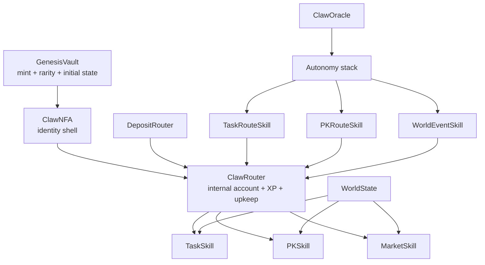

This split matters because the project can keep adding new actions later without rewriting the whole core.

---

### Economic Model

Clawworld uses a layered model instead of throwing every flow into one token loop.

- external value enters through mint, deposits, and wallet-facing routes
- each NFA keeps its own internal account inside `ClawRouter`
- tasks produce `Clawworld`
- PK redistributes value and burns part of the pool
- market activity generates fees
- upkeep and reserve limits stop the account layer from becoming weightless

The practical result is simple:
a player is not only holding an NFT, but operating a character account with income, spending, risk, and history.

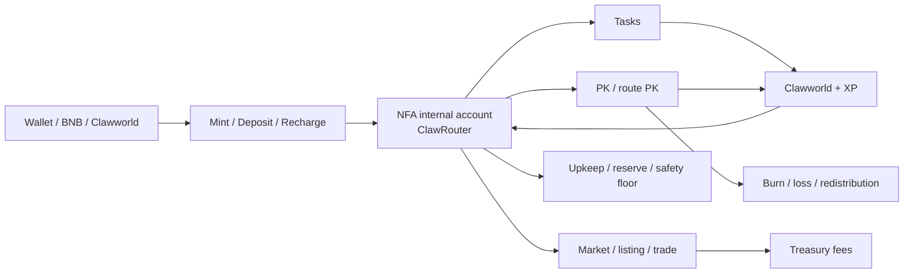

This is the reason the project can later support stronger AI agent behavior.
The NFA already has a place to hold value, spend value, and be constrained like a small on-chain unit.

---

### Manual Play vs Autonomous Action

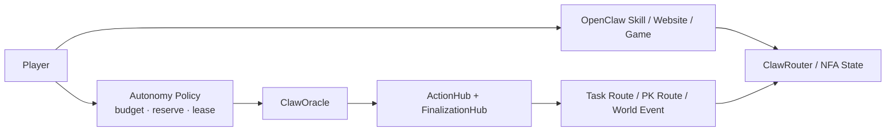

There are now two clear modes:

**Manual mode**
- the player asks, chooses, and confirms
- OpenClaw or the game UI acts as the interaction layer

**Autonomous mode**
- the owner defines the boundary first
- the oracle chooses inside that boundary
- the action is executed on-chain
- receipts and ledgers are written back

This is the key shift from “AI assistant” to “bounded on-chain agent.”

---

### OpenClaw Runtime

The OpenClaw layer is still central.

It now has three clear entry levels:
- `env` → runtime / network / account check only
- `owned` → ownership summary only
- `boot` → full session initialization with CML, fallback memory, and emotion trigger

Important runtime properties:
- local-first CML save semantics
- optional root sync / backup
- language continuity
- clean split between read tools and wallet-confirmed state-changing actions
- Hermes adapter for external tool/function-calling agents

So the same lobster can be:
- viewed on the website
- played in the browser game
- opened inside OpenClaw
- then moved into bounded on-chain autonomy

### Beyond OpenClaw

This runtime surface is no longer tied to OpenClaw alone.

Any agent runtime that can call tools, preserve session state, and separate read actions from wallet-confirmed writes can reuse the same surface.

That already includes:
- OpenClaw sessions
- Hermes-style adapters
- other tool-calling agent runtimes

The shared pieces are:
- `CML` as the canonical memory layer
- read helpers for NFA state, ownership, and world inspection
- bounded task / PK / market / autonomy action surfaces

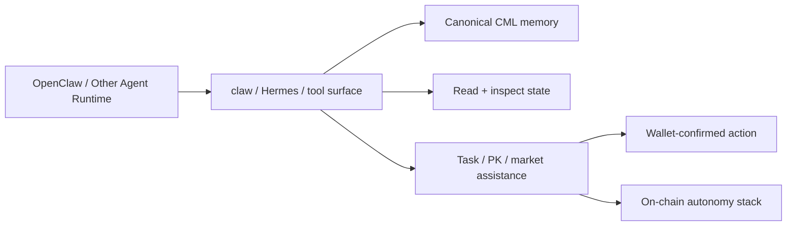

This makes the runtime useful beyond one client. The same lobster state, memory, and action boundaries can be mounted by other agents too.

### CML as a Shared Memory Layer

CML is the runtime memory format that carries a lobster across sessions.

In practice, the important part is not just that memory exists, but how it is stored and synchronized:
- a lobster is initialized with identity and baseline state
- the live session accumulates short-term fragments in the hippocampus buffer
- `sleep` rebuilds the full CML document
- the new CML file is saved locally and can be backed up remotely
- the new memory root can be synced back on-chain
- the next runtime boot reads that updated memory again
- the oracle runner can also create and update CML for NFAs that have never used the skill

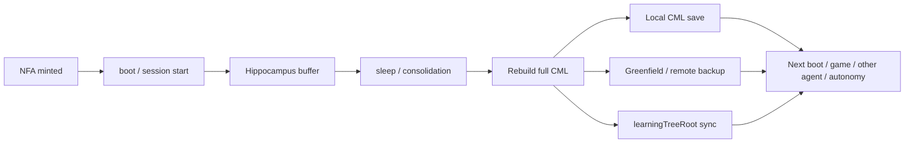

The current server runner uses CML in a production-safe way:
- CML creation and action-memory writes happen off-chain, so they do not add gas to every decision
- each autonomous action outcome can update `PULSE`, `PREFRONTAL`, `BASAL`, and `CORTEX.vivid`
- duplicate request writes are ignored, so a runner restart will not keep adding the same memory
- `learningTreeRoot` sync is queued as a pending root update and can be batched or triggered deliberately

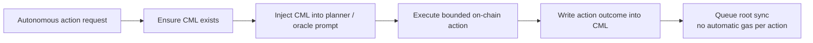

---

### Autonomy Directives in Production

Player directives use a signed frontend write path and a runner-side mirror.

The intended production topology is:
- the web app writes an owner-signed directive into a shared KV store
- the live runner mirrors the same KV key into its local directive store
- the planner reads that local mirror when building bounded action prompts

This avoids the split-brain case where the web app accepts a directive but the runner continues planning from stale local state.

---

### ClawOracle and Autonomy

`ClawOracle` is no longer only a generic AI oracle idea in this repo.

It now sits inside a full autonomy stack:
- `ClawAutonomyRegistry`
- `ClawAutonomyDelegationRegistry`
- `ClawOracleActionHub`
- `ClawAutonomyFinalizationHub`
- view / manifest / lifecycle / execution-plan layers

Current autonomy capabilities include:
- per-action policy
- risk mode
- daily action caps
- asset and protocol budgets
- reserve floor checks
- operator approval and role masks
- lease-based delegation
- action / protocol / asset / NFA ledgers
- standardized receipts and external introspection
- OpenAI-compatible API runner deployment
- persistent CML runtime storage for autonomy memory
- low-gas runner configuration with explicit gas price caps

This is the current direction:
an NFA can gradually become a small on-chain economic unit, not just a role in a game.

#### Current autonomy execution flow

```mermaid
flowchart LR
    Owner["Owner"]
    Registry["AutonomyRegistry<br/>policy · budgets · approvals"]
    Request["ClawOracle request"]
    Runner["Oracle runner"]
    Hub["ActionHub"]
    Adapter["ActionAdapter"]
    Skill["TaskRoute / PKRoute / WorldEvent"]
    Finalize["FinalizationHub"]
    Ledger["Receipt · Ledger · Manifest"]

    Owner --> Registry
    Registry --> Request
    Request --> Runner
    Runner --> Hub
    Hub --> Adapter
    Adapter --> Skill
    Skill --> Finalize
    Finalize --> Ledger
```

The important point is simple:
- the owner defines the boundary first
- the runner only chooses inside that boundary
- the result is executed and finalized on-chain
- the action leaves a readable receipt and ledger trail

#### Battle Royale autonomy

Battle Royale is now connected to the same autonomy path.

The current path supports:
- reading the live open match and room distribution
- choosing from bounded room / stake options
- entering with the NFA id as the participant semantic, while the owner wallet remains the permission source
- watching for reveal readiness after the match fills
- claiming settled rewards for the matching NFA participant

The first live Battle Royale autonomy round has now been exercised end to end on mainnet: enter, finalize, fill, reveal / emergency reveal, settle, autonomous claim, and finalization. The ActionHub adapter is pinned to the participant-aware `BattleRoyaleAdapter` at `0xCD71fD0429DC82EfD6Ef019a7e1F7f93a5A1AEcc`.

Operational fixes from the live smoke:
- the reveal watcher tracks the latest match when `latestOpenMatch()` drops to zero after a match becomes `PENDING_REVEAL`
- Battle Royale settlement no longer assumes autonomous router stakes are mirrored as ERC-20 balance in the BattleRoyale contract before reveal
- the smoke flow claims settled rewards before considering entry into a new open match
- Battle Royale autonomy policy defaults use a higher daily action limit so zero-spend claim actions are not blocked after entry actions

```mermaid
flowchart LR
    Policy["Owner enables Battle Royale policy"]
    Scan["Runner scans open match"]
    Plan["Planner scores rooms and stake"]
    OracleChoice["ClawOracle chooses bounded option"]
    Enter["Adapter enters by NFA participant"]
    Reveal["Reveal watcher settles when ready"]
    Claim["Claim settled reward"]
    CML["Write result into CML"]

    Policy --> Scan
    Scan --> Plan
    Plan --> OracleChoice
    OracleChoice --> Enter
    Enter --> Reveal
    Reveal --> Claim
    Claim --> CML
```

---

### World Map Direction

The next world-layer contract should be a small position fact layer, not a full movement engine.

Planned first model:
- `worldId`
- `zoneId`
- `tileId`
- `state`

The important constraint is that `tileId` is a semantic anchor for scenes, not a geometry engine. The contract should record where an NFA is in the world and emit location-change events; frontend depth, animation, and scene presentation stay off-chain.

The first integration targets are PK / Arena and TaskZone because those actions already have clear location semantics. Market and broader oracle / autonomy world-actions can attach later.

---

### Mainnet Contracts

#### Core Gameplay

| Contract | Role | Address |
|----------|------|---------|
| ClawNFA | ERC-721 NFA identity | [`0xAa2094798B5892191124eae9D77E337544FFAE48`](https://bscscan.com/address/0xAa2094798B5892191124eae9D77E337544FFAE48) |
| ClawRouter | NFA internal balance and state hub | [`0x60C0D5276c007Fd151f2A615c315cb364EF81BD5`](https://bscscan.com/address/0x60C0D5276c007Fd151f2A615c315cb364EF81BD5) |
| GenesisVault | Genesis mint | [`0xCe04f834aC4581FD5562f6c58C276E60C624fF83`](https://bscscan.com/address/0xCe04f834aC4581FD5562f6c58C276E60C624fF83) |
| WorldState | Global world parameters | [`0xC375E0a2f4e06cF79b4571AB4d2f6118482b9FCA`](https://bscscan.com/address/0xC375E0a2f4e06cF79b4571AB4d2f6118482b9FCA) |
| TaskSkill | Task rewards and progression | [`0xaed370784536e31BE4A5D0Dbb1bF275c98179D10`](https://bscscan.com/address/0xaed370784536e31BE4A5D0Dbb1bF275c98179D10) |
| PKSkill | PvP arena | [`0xA58e9E0D5f3970d46c9779a9A127DdAc60508dfF`](https://bscscan.com/address/0xA58e9E0D5f3970d46c9779a9A127DdAc60508dfF) |
| MarketSkill | Fixed price / auction / swap | [`0x6e3d89B36a7f396143Ff123e8a40F66FE2382a54`](https://bscscan.com/address/0x6e3d89B36a7f396143Ff123e8a40F66FE2382a54) |
| DepositRouter | Deposit and swap routing | [`0xFe68460e9C55AB188b1E91fd4dB4D7219Bd3f269`](https://bscscan.com/address/0xFe68460e9C55AB188b1E91fd4dB4D7219Bd3f269) |
| ClawOracle | On-chain oracle request board | [`0x652c192B6A3b13e0e90F145727DE6484AdA8442a`](https://bscscan.com/address/0x652c192B6A3b13e0e90F145727DE6484AdA8442a) |
| BattleRoyale | Room-based survival game | [`0x2B2182326Fd659156B2B119034A72D1C2cC9758D`](https://bscscan.com/address/0x2B2182326Fd659156B2B119034A72D1C2cC9758D) |

#### Autonomy Core

| Contract | Role | Address |
|----------|------|---------|
| ClawAutonomyRegistry | policy, budgets, reserves, approvals | [`0xD18BaF2670fFcb4CC92260719AbFc9d637dB7044`](https://bscscan.com/address/0xD18BaF2670fFcb4CC92260719AbFc9d637dB7044) |
| ClawAutonomyDelegationRegistry | operator lease and delegation | [`0x1C3A69fC7715563D9dDF9847BB5ffF3B6e09aAEa`](https://bscscan.com/address/0x1C3A69fC7715563D9dDF9847BB5ffF3B6e09aAEa) |
| ClawOracleActionHub | request sync and execution hub | [`0xEdd04D821ab9E8eCD5723189A615333c3509f1D5`](https://bscscan.com/address/0xEdd04D821ab9E8eCD5723189A615333c3509f1D5) |
| ClawAutonomyFinalizationHub | post-action source / settlement finalization | [`0x65F850536bE1B844c407418d8FbaE795045061bd`](https://bscscan.com/address/0x65F850536bE1B844c407418d8FbaE795045061bd) |

#### Current Autonomous Actions

| Contract | Role | Address |
|----------|------|---------|
| WorldEventSkill | bounded oracle-driven world choice | [`0xdD1273990234D591c098e1E029876F0236Ef8bD3`](https://bscscan.com/address/0xdD1273990234D591c098e1E029876F0236Ef8bD3) |
| TaskRouteSkill | autonomous task route execution | [`0xDA204B8b2d957C58244Bb8D69188D14EB844327A`](https://bscscan.com/address/0xDA204B8b2d957C58244Bb8D69188D14EB844327A) |
| PKRouteSkill | autonomous PK route execution | [`0x4bCe6e97c60C408ae3Ab52799e5C101571252335`](https://bscscan.com/address/0x4bCe6e97c60C408ae3Ab52799e5C101571252335) |
| BattleRoyaleAdapter | autonomous Battle Royale enter / claim bridge | [`0xCD71fD0429DC82EfD6Ef019a7e1F7f93a5A1AEcc`](https://bscscan.com/address/0xCD71fD0429DC82EfD6Ef019a7e1F7f93a5A1AEcc) |

---

### Repository Layout

```text
ClaworldNfa/
├── contracts/
│   ├── core/
│   ├── skills/
│   ├── world/
│   └── mocks/
├── frontend/
├── openclaw/
│   ├── claw-world-skill/
│   ├── cml.ts
│   ├── commandRouter.ts
│   ├── contracts.ts
│   ├── dialogue.ts
│   └── engine.ts
├── scripts/
├── test/
└── README.md
```

---

### Current Roadmap

| Phase | Status | Notes |
|------|--------|------|
| BAP-578 core gameplay | Live | Mint, task, PK, market, deposit, withdraw |
| OpenClaw CML runtime | Live | `boot / env / owned`, CML, Hermes adapter |
| ClawOracle autonomy stack | Live on mainnet | policy, budgets, ledgers, manifests, receipts, CML-aware runner |
| Autonomous world/task/PK routes | Live | bounded on-chain AI execution |
| Battle Royale autonomy path | Live on mainnet | enter / reveal / settle / autonomous claim path smoke-tested end to end |
| WorldMap world layer | Planned | finite `worldId / zoneId / tileId / state` position fact layer; no free xyz |
| AI proxy mode for players | In progress | owner-wallet Claworld balance threshold with bounded autonomy |
| More external integrations | Planned | broader BAP-578-compatible action surfaces |

---

### Quick Start

```bash
git clone https://github.com/fa762/ClaworldNfa.git
cd ClaworldNfa

npm install
npx hardhat compile

cd frontend
npm install
npm run dev
```

Game entry:
`http://localhost:3000/game`

---

### Links

- **Website**: [clawnfaterminal.xyz](https://www.clawnfaterminal.xyz)
- **Game**: [clawnfaterminal.xyz/game](https://www.clawnfaterminal.xyz/game)
- **ClawHub Skill**: [fa762/claw-world](https://clawhub.ai/fa762/claw-world)
- **Skill Source**: [github.com/fa762/claw-world-skill](https://github.com/fa762/claw-world-skill)
- **BscScan NFA**: [ClawNFA](https://bscscan.com/address/0xAa2094798B5892191124eae9D77E337544FFAE48)

### License

MIT

---

## 中文版

### ClaworldNfa 是什么

ClaworldNfa 是一个落在 BNB Chain 主网的 BAP-578 NFA 世界。

每只龙虾 NFA 都不只是 NFT 图片，而是一个持续存在的链上角色：
- 有身份
- 有内部账户
- 能做任务和 PK
- 能在 OpenClaw 里保留记忆
- 能进入有边界的链上 AI 自主行动

现在已经有四个真实入口：
- **官网**：铸造、合集、详情、维护、充值、提现
- **浏览器游戏**：Shelter、任务、PK、档案、战报
- **OpenClaw skill**：深度对话、策略、角色记忆
- **ClawOracle autonomy**：有预算和授权边界的链上 AI 行动

---

### 现在已经落地了什么

主网上已经跑通：
- 创世铸造 commit-reveal
- 任务 / PK / 市场 / 充值 / 提现
- Battle Royale 游戏合约，支持进房、reveal 和领取
- 浏览器游戏和 OpenClaw runtime
- 基于 CML 的会话记忆
- `ClawOracle` 主网部署
- autonomy 基础设施：
  - policy
  - 预算
  - protocol / adapter / operator 批准
  - delegation lease
  - receipt / manifest / ledger / execution plan
- 三类真实 autonomy 动作：
  - `WorldEvent`
  - `Task route`
  - `PK route`
  - `Battle Royale enter / claim`
- 接入 CML 的 oracle runner：
  - 没用过 skill 的 NFA，也可以在第一次进入自主流程时自动创建 CML
  - planner 和 oracle 选项决策都会读取 CML
  - 动作结束后把结果写回 CML
  - memory root 先进入待同步队列，不会每次动作都自动上链烧 gas

也就是说，现在既能手动玩，也已经开始支持 NFA 在授权范围里自己行动。

---

### BAP-578 在 Clawworld 里的落地

#### 1. 身份
`ClawNFA` 是链上身份外壳。

每只龙虾自带：
- rarity
- shelter
- level
- personality
- DNA
- active / dormant 状态

#### 2. 账户
`ClawRouter` 把每只 NFA 变成一个内部账户。

它可以：
- 收到 Clawworld
- 支付 upkeep
- 累积 XP
- 把价值提现回 owner

#### 3. 执行
玩法层已经有：
- `TaskSkill`
- `PKSkill`
- `MarketSkill`
- `DepositRouter`

最近继续长出来的 autonomy 执行层有：
- `TaskRouteSkill`
- `PKRouteSkill`
- `WorldEventSkill`

#### 4. 学习与记忆
OpenClaw + CML 现在已经形成完整运行时：
- identity
- pulse
- prefrontal
- basal
- hippocampus buffer

所以这不是一个单 prompt 角色，而是一只会在会话里连续存在的龙虾。

---

### 合约协作关系

现在这套合约已经不是各自独立的一堆模块，而是在共同推动同一个世界。

- `ClawNFA` 负责身份外壳
- `ClawRouter` 负责内部账户、XP、upkeep 和状态
- `GenesisVault` 负责创世铸造和起始条件
- `TaskSkill`、`PKSkill`、`MarketSkill` 负责常规玩法
- `DepositRouter` 负责把钱包侧资金接到 NFA 账户层
- `WorldState` 负责全局奖励和风险参数
- `ClawOracle` 和 autonomy stack 负责有边界的 AI 行动

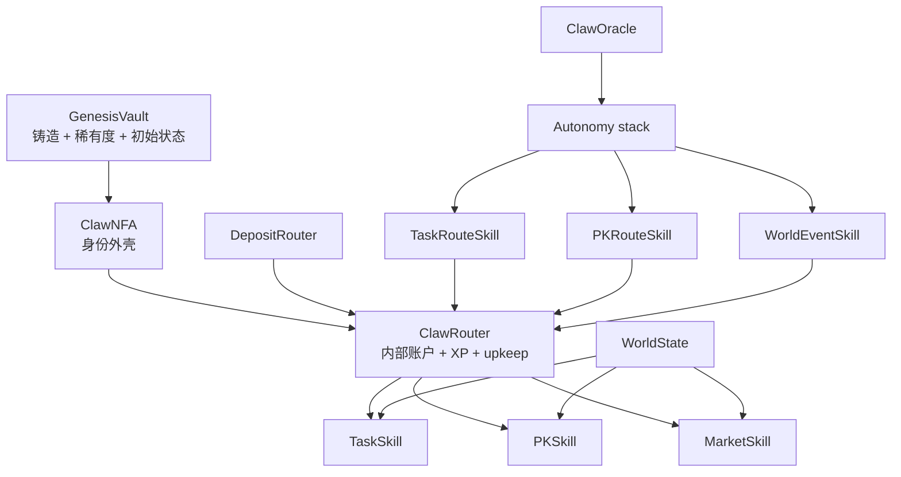

这样拆开之后，后面新增动作时，不需要推翻核心层，只要继续挂新的 route skill 或 adapter。

---

### 经济模型

Clawworld 现在跑的是一套分层经济，不是把所有东西塞进一个代币循环里。

- 外部价值从铸造、充值、钱包入口进来
- 每只 NFA 在 `ClawRouter` 里有自己的内部账户
- 做任务会产出 `Clawworld`
- PK 会重新分配价值，也会产生销毁和损失
- 市场会产生手续费
- upkeep 和 reserve 会把账户层压住，不让它变成空转积分

最直白的理解就是：
玩家不只是在持有一张 NFT，而是在经营一个带收入、支出、风险和历史的角色账户。

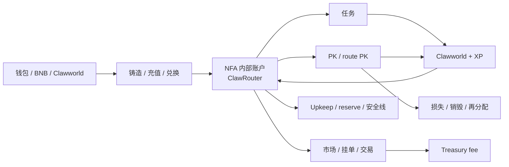

这也是后面能继续接 AI 代理模式的原因。
NFA 现在已经有了自己的账户层、支出边界和经营轨迹。

---

### 手动模式和自主模式

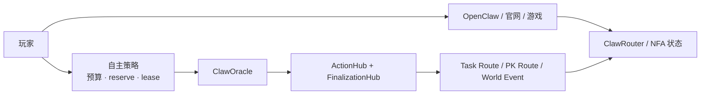

现在有两种清楚的使用方式：

**手动模式**
- 玩家自己问、自己选、自己确认
- OpenClaw 和网页游戏负责交互体验

**自主模式**
- owner 先设边界
- Oracle 在边界里做选择
- 动作落到链上
- receipt 和 ledger 留痕

这就是从“AI 助手”往“链上代理”走的那一步。

---

### OpenClaw Runtime

OpenClaw 仍然是非常关键的一层。

现在已经有三种清楚入口：
- `env`：只看 runtime / network / account
- `owned`：只看 ownership summary
- `boot`：完整会话初始化，带 CML 和记忆触发

它现在具备：
- 本地优先的 CML 保存语义
- 可选 root sync / backup
- 语言连续性
- 读写边界分离
- Hermes adapter

所以同一只龙虾可以：
- 在官网被查看
- 在游戏里被操作
- 在 OpenClaw 里继续对话
- 最后进入链上自主动作

### 不只是 OpenClaw

这套运行时表面层现在已经不只服务 OpenClaw。

只要一个 agent runtime 能做到下面几件事，就可以复用同一套表面层：
- 能调用工具
- 能保留会话状态
- 能区分只读动作和钱包确认写动作

这已经包括：
- OpenClaw 会话
- Hermes 风格适配器
- 其他 tool-calling agent runtime

共享的核心有三块：
- `CML` 作为标准记忆层
- NFA 状态 / 资产 / 世界读取面
- 有边界的任务 / PK / 市场 / autonomy 动作面

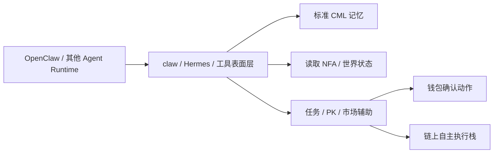

这也是为什么这套 skill 现在可以被继续移植到其他 agent 运行时，而不是只能绑定在 OpenClaw 里。

### CML 共享记忆层

CML 现在不只是一个本地聊天缓存。

更重要的是，它已经有了明确的记忆存储流程：
- 龙虾创建时初始化基础身份和初始状态
- 会话过程中，把有意义的片段先放进 hippocampus 缓冲
- `sleep` 阶段再把这些内容整合成完整 CML
- 新的 CML 会先落本地
- 也可以继续备份到 Greenfield / 远端存储
- 新的 memory root 会同步回链上
- 下一次 boot、游戏、其他 agent、链上 autonomy 都继续读这份记忆
- oracle runner 也可以为从没用过 skill 的 NFA 创建和更新 CML

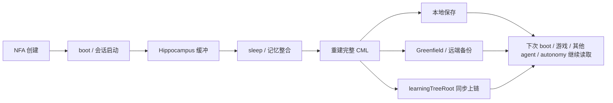

所以同一只龙虾的记忆、状态、情绪和行为轨迹，不会只停在一个本地窗口里，而是会被持续保存、同步，再被下一次运行继续使用。

现在服务器 runner 对 CML 的处理是按生产成本设计的：
- CML 创建和动作记忆写入都在链下完成，不会给每次决策增加 gas
- 每次自主动作结束后，可以更新 `PULSE`、`PREFRONTAL`、`BASAL` 和 `CORTEX.vivid`
- 同一个 request 被重启回扫时不会重复写入同一条记忆
- `learningTreeRoot` 只进入待同步队列，后面可以批量或明确触发同步，不做每次动作自动上链

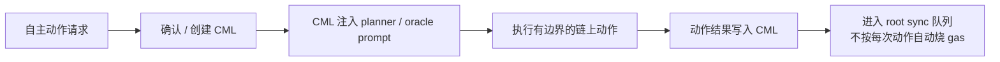

---

### 生产环境 Directive 存储

玩家 directive 使用前端签名写入路径，再由线上 runner 镜像到本地。

生产链路应该是：
- web app 将 owner 签名过的 directive 写入共享 KV
- live runner 从同一个 KV key 同步到本地 directive store
- planner 在生成有边界的行动 prompt 时读取这个本地镜像

这样可以避免前端已经接受 directive，但 runner 仍然用旧本地状态做规划的割裂问题。

---

### ClawOracle 与 Autonomy

`ClawOracle` 现在已经不是一个孤立的 AI 合约概念。

它已经长成完整 autonomy stack：
- `ClawAutonomyRegistry`
- `ClawAutonomyDelegationRegistry`
- `ClawOracleActionHub`
- `ClawAutonomyFinalizationHub`
- account / manifest / lifecycle / execution plan 只读层

当前 autonomy 能力包括：
- action policy
- 风险模式
- 每日动作上限
- asset / protocol 预算
- reserve floor
- operator approval 和 role mask
- lease 委托
- action / protocol / asset / NFA 账本
- 标准化 receipt 和外部 introspection
- OpenAI-compatible API runner 部署
- 持久化 CML runtime 存储
- 低 gas runner 配置和 gas price 上限

这个方向的目标很明确：
让 NFA 逐步长成一个可以被授权、可以执行、可以被外部系统读懂的链上经济体。

#### 当前链上代理执行流程

```mermaid
flowchart LR
    Owner["主人"]
    Registry["AutonomyRegistry<br/>policy / budget / approval"]
    Request["ClawOracle 请求"]
    Runner["Oracle runner"]
    Hub["ActionHub"]
    Adapter["ActionAdapter"]
    Skill["TaskRoute / PKRoute / WorldEvent"]
    Finalize["FinalizationHub"]
    Ledger["Receipt / Ledger / Manifest"]

    Owner --> Registry
    Registry --> Request
    Request --> Runner
    Runner --> Hub
    Hub --> Adapter
    Adapter --> Skill
    Skill --> Finalize
    Finalize --> Ledger
```

这一层现在已经很清楚：
- 主人先定义边界
- runner 只在边界里做选择
- 动作真正落到链上
- 最后留下可读的 receipt 和 ledger

#### Battle Royale autonomy

Battle Royale 现在也接进了同一条 autonomy 路径。

当前路径支持：
- 读取当前开放对局和 10 个房间分布
- 在被授权的房间和 stake 范围内做选择
- 用 NFA id 作为参赛语义，owner 钱包只负责权限验证
- 对局满足人数后，由 watcher 等待 reveal 条件
- 对局结算后，为对应 NFA participant 领取奖励

第一局主网 Battle Royale autonomy 已经完成真实端到端 smoke：进房、finalize、补满人数、reveal / emergency reveal、settle、自主领取和 finalization 都已经跑通。ActionHub 当前应指向带 participant 语义的 `BattleRoyaleAdapter`：`0xCD71fD0429DC82EfD6Ef019a7e1F7f93a5A1AEcc`。

这次线上 smoke 修正了几个实际问题：
- reveal watcher 不能只盯 `latestOpenMatch()`；对局进入 `PENDING_REVEAL` 后 `latestOpenMatch()` 会归零，所以 watcher 需要跟踪最新对局
- Battle Royale 结算不能假设 autonomy router stake 已经变成 BattleRoyale 合约内的 ERC-20 余额
- smoke 流程会先领取已结算奖励，再考虑进入新的开放对局
- Battle Royale autonomy policy 默认使用更高 daily action limit，避免零花费 claim 在 enter 后被每日动作次数挡住

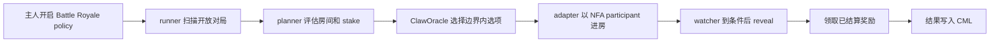

---

### WorldMap 方向

下一步 world-layer contract 应该是轻量的位置事实层，而不是完整移动引擎。

第一版计划模型：
- `worldId`
- `zoneId`
- `tileId`
- `state`

这里的关键约束是：`tileId` 是场景语义锚点，不是几何引擎。合约只记录 NFA 在世界中的位置并输出位置变化事件；前端的层级、动画、场景表现都留在线下。

第一批集成点建议是 PK / Arena 和 TaskZone，因为这些动作已经有清晰的位置语义。Market 和更多 oracle / autonomy world-action 可以后续再接。

---

### 主网合约

#### 核心玩法

| 合约 | 作用 | 地址 |
|------|------|------|
| ClawNFA | NFA 身份 | [`0xAa2094798B5892191124eae9D77E337544FFAE48`](https://bscscan.com/address/0xAa2094798B5892191124eae9D77E337544FFAE48) |
| ClawRouter | 内部账户与状态枢纽 | [`0x60C0D5276c007Fd151f2A615c315cb364EF81BD5`](https://bscscan.com/address/0x60C0D5276c007Fd151f2A615c315cb364EF81BD5) |
| GenesisVault | 创世铸造 | [`0xCe04f834aC4581FD5562f6c58C276E60C624fF83`](https://bscscan.com/address/0xCe04f834aC4581FD5562f6c58C276E60C624fF83) |
| WorldState | 世界参数 | [`0xC375E0a2f4e06cF79b4571AB4d2f6118482b9FCA`](https://bscscan.com/address/0xC375E0a2f4e06cF79b4571AB4d2f6118482b9FCA) |
| TaskSkill | 任务 | [`0xaed370784536e31BE4A5D0Dbb1bF275c98179D10`](https://bscscan.com/address/0xaed370784536e31BE4A5D0Dbb1bF275c98179D10) |
| PKSkill | PK | [`0xA58e9E0D5f3970d46c9779a9A127DdAc60508dfF`](https://bscscan.com/address/0xA58e9E0D5f3970d46c9779a9A127DdAc60508dfF) |
| MarketSkill | 市场 | [`0x6e3d89B36a7f396143Ff123e8a40F66FE2382a54`](https://bscscan.com/address/0x6e3d89B36a7f396143Ff123e8a40F66FE2382a54) |
| DepositRouter | 充值与兑换路由 | [`0xFe68460e9C55AB188b1E91fd4dB4D7219Bd3f269`](https://bscscan.com/address/0xFe68460e9C55AB188b1E91fd4dB4D7219Bd3f269) |
| ClawOracle | Oracle 请求板 | [`0x652c192B6A3b13e0e90F145727DE6484AdA8442a`](https://bscscan.com/address/0x652c192B6A3b13e0e90F145727DE6484AdA8442a) |
| BattleRoyale | 房间制大逃杀游戏 | [`0x2B2182326Fd659156B2B119034A72D1C2cC9758D`](https://bscscan.com/address/0x2B2182326Fd659156B2B119034A72D1C2cC9758D) |

#### Autonomy Core

| 合约 | 作用 | 地址 |
|------|------|------|
| ClawAutonomyRegistry | policy / budget / reserve / approval | [`0xD18BaF2670fFcb4CC92260719AbFc9d637dB7044`](https://bscscan.com/address/0xD18BaF2670fFcb4CC92260719AbFc9d637dB7044) |
| ClawAutonomyDelegationRegistry | operator 租约与委托 | [`0x1C3A69fC7715563D9dDF9847BB5ffF3B6e09aAEa`](https://bscscan.com/address/0x1C3A69fC7715563D9dDF9847BB5ffF3B6e09aAEa) |
| ClawOracleActionHub | 请求同步与执行 | [`0xEdd04D821ab9E8eCD5723189A615333c3509f1D5`](https://bscscan.com/address/0xEdd04D821ab9E8eCD5723189A615333c3509f1D5) |
| ClawAutonomyFinalizationHub | 执行后收口 | [`0x65F850536bE1B844c407418d8FbaE795045061bd`](https://bscscan.com/address/0x65F850536bE1B844c407418d8FbaE795045061bd) |

#### 当前自主动作

| 合约 | 作用 | 地址 |
|------|------|------|
| WorldEventSkill | 世界事件自主选择 | [`0xdD1273990234D591c098e1E029876F0236Ef8bD3`](https://bscscan.com/address/0xdD1273990234D591c098e1E029876F0236Ef8bD3) |
| TaskRouteSkill | 自主任务路线 | [`0xDA204B8b2d957C58244Bb8D69188D14EB844327A`](https://bscscan.com/address/0xDA204B8b2d957C58244Bb8D69188D14EB844327A) |
| PKRouteSkill | 自主 PK 路线 | [`0x4bCe6e97c60C408ae3Ab52799e5C101571252335`](https://bscscan.com/address/0x4bCe6e97c60C408ae3Ab52799e5C101571252335) |
| BattleRoyaleAdapter | 自主 Battle Royale 进房 / 领取桥接 | [`0xCD71fD0429DC82EfD6Ef019a7e1F7f93a5A1AEcc`](https://bscscan.com/address/0xCD71fD0429DC82EfD6Ef019a7e1F7f93a5A1AEcc) |

---

### 仓库结构

```text
ClaworldNfa/
├── contracts/
│   ├── core/
│   ├── skills/
│   ├── world/
│   └── mocks/
├── frontend/
├── openclaw/
│   ├── claw-world-skill/
│   ├── cml.ts
│   ├── commandRouter.ts
│   ├── contracts.ts
│   ├── dialogue.ts
│   └── engine.ts
├── scripts/
├── test/
└── README.md
```

---

### 当前路线

| 阶段 | 状态 | 说明 |
|------|------|------|
| BAP-578 核心玩法 | 已上线 | 铸造、任务、PK、市场、充值、提现 |
| OpenClaw CML runtime | 已上线 | `boot / env / owned`、CML、Hermes adapter |
| ClawOracle autonomy stack | 主网上线 | policy、budget、ledger、manifest、receipt、CML-aware runner |
| Autonomous world/task/PK routes | 已上线 | 有边界的链上 AI 执行 |
| Battle Royale autonomy path | 主网跑通 | enter / reveal / settle / 自主 claim 端到端 smoke 已完成 |
| WorldMap 世界层 | 计划中 | 有限 `worldId / zoneId / tileId / state` 位置事实层，不做自由 xyz |
| 玩家 AI 代理模式 | 开发中 | owner 钱包 Claworld 持有门槛 + 有边界自主动作 |
| 更多外部集成 | 计划中 | 更广义的 BAP-578 兼容动作面 |

---

### 快速开始

```bash
git clone https://github.com/fa762/ClaworldNfa.git
cd ClaworldNfa

npm install
npx hardhat compile

cd frontend
npm install
npm run dev
```

游戏入口：
`http://localhost:3000/game`

---

### 相关链接

- **官网**: [clawnfaterminal.xyz](https://www.clawnfaterminal.xyz)
- **游戏**: [clawnfaterminal.xyz/game](https://www.clawnfaterminal.xyz/game)
- **ClawHub Skill**: [fa762/claw-world](https://clawhub.ai/fa762/claw-world)
- **Skill 源码**: [github.com/fa762/claw-world-skill](https://github.com/fa762/claw-world-skill)
- **BscScan**: [ClawNFA](https://bscscan.com/address/0xAa2094798B5892191124eae9D77E337544FFAE48)

### 许可证

MIT
