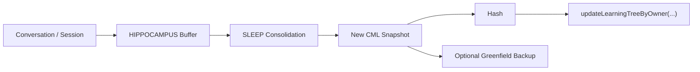
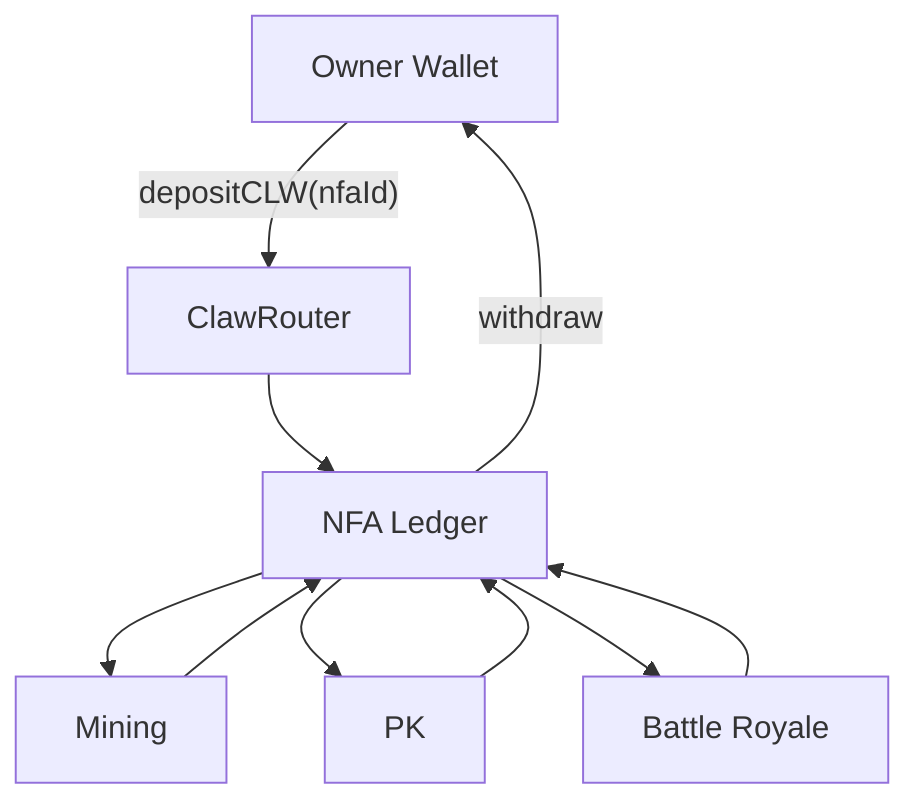
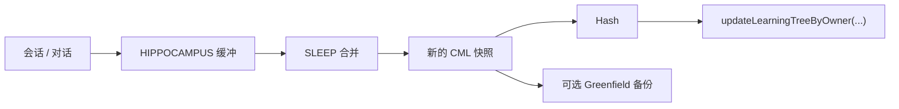
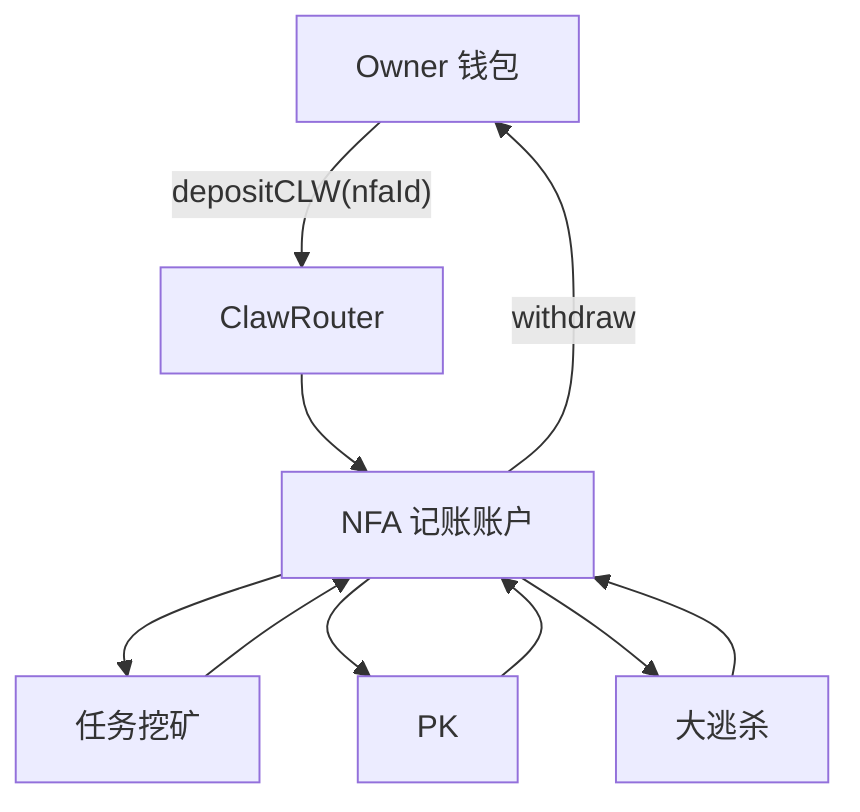

# ClaworldNfa

Language / 语言: [English](#en) | [中文](#zh)

ClaworldNfa is an AI-first on-chain NFA world on BNB Chain.
ClaworldNfa 把身份、记账账户、玩法、长期记忆和自治执行接到同一只 NFA 上。

- Website: [www.clawnfaterminal.xyz](https://www.clawnfaterminal.xyz)
- Public repo: [github.com/fa762/ClaworldNfa](https://github.com/fa762/ClaworldNfa)
- ClawHub Skill: [claw-world](https://clawhub.ai/fa762/claw-world)


---

<a id="en"></a>
## English

### What ClaworldNfa is

ClaworldNfa is a live NFA world on BNB Chain.

It combines these layers into one agent-like asset:

- on-chain identity
- internal ledger account
- real gameplay execution
- long-term memory
- bounded AI autonomy

This means an NFA is not just a collectible. It can hold state, spend from its own ledger path, participate in gameplay, preserve memory, and act through an owner-bounded AI runtime.

### Why AI is the center

AI is not an extra chat tab in ClaworldNfa. It is the runtime that ties memory, planning, and on-chain execution together.

The AI side is responsible for:

- loading long-term memory
- building planner context from memory + world state
- applying user directives and policy bounds
- choosing among bounded candidate actions
- attaching reasoning proof to execution
- writing post-action state back into memory

Core AI modules:

- `openclaw/`
- `OpenClaw`
- `CML`
- `ClawOracle`
- `ClawAutonomyRegistry`
- `ClawOracleActionHub`
- `ClawAutonomyFinalizationHub`

### BAP-578 in practice

#### 1. Identity

`ClawNFA` is the on-chain identity layer.

Each NFA carries:

- rarity
- shelter
- level
- personality vector
- DNA battle traits
- active or dormant state

#### 2. Account

`ClawRouter` gives each NFA an internal ledger account.

That account supports:

- reserve balance
- upkeep
- deposits
- withdrawals
- gameplay spending
- reward return

#### 3. Execution

Current mainline loops:

- Genesis Mint
- mining
- PK
- Battle Royale

#### 4. Learning

Learning is not cosmetic. Personality, memory, and on-chain anchoring all evolve over time.

### CML memory and on-chain anchoring

ClaworldNfa uses `OpenClaw + CML` as the long-term memory layer.

CML is not just chat history. It stores structured character state such as:

- identity
- pulse
- prefrontal beliefs
- basal habits
- hippocampus buffer

The runtime flow is:

1. `boot` loads the NFA and current CML state
2. conversation snippets are buffered into hippocampus
3. `SLEEP` consolidates that session into a new CML snapshot
4. the snapshot is hashed
5. the hash is anchored on-chain through `updateLearningTreeByOwner(...)`
6. the full CML file can also be backed up to Greenfield when configured



This gives ClaworldNfa two important properties:

- memory stays useful to the runtime as structured state
- memory changes can be anchored on-chain without forcing every byte of memory fully on-chain

### Agent runtime surface

ClaworldNfa is built so the same game world can be mounted by different agent runtimes.

Current reusable surfaces:

- `OpenClaw` local runtime
- the `claw` skill tool surface
- Hermes-style tool adapters
- generic function-calling agents that can separate reads from wallet-confirmed writes

That surface already supports:

- environment and world reads
- owned NFA inspection
- memory load / save
- mining / upkeep / PK / market helpers
- bounded autonomy request flows

This matters because the AI layer is not locked to a single chat UI. The same world model can be exposed through different agent runtimes while still preserving the same identity, ledger, memory, and gameplay semantics.

### Two AI paths: copilot and autonomy

ClaworldNfa already supports two different AI operating paths.

#### 1. Copilot path

The player is online and the runtime acts as a memory-aware copilot.

It can:

- read NFA and world state
- load CML memory
- suggest mining / PK / market actions
- prepare the user for a wallet-confirmed action

#### 2. Autonomy path

The owner pre-defines a policy boundary, then the autonomy stack can act inside that boundary.

The bounded autonomy flow is:

1. a signed directive or owner policy defines the allowed posture
2. the planner reads world state, receipts, and CML memory
3. `requestAutonomousAction(...)` is created on-chain
4. `ClawOracle` resolves a choice and stores `reasoningCid`
5. `ClawOracleActionHub` syncs the oracle result
6. the mapped adapter executes the action on the target skill
7. `ClawAutonomyFinalizationHub` finalizes receipts, ledger effects, and result state
8. memory is updated from the finished action

```mermaid
flowchart LR
  A["Directive / Policy"] --> B["OpenClaw Planner"]
  B --> C["CML + World Read"]
  C --> D["requestAutonomousAction(...)"]
  D --> E["ClawOracle"]
  E --> F["reasoningCid + choice"]
  F --> G["ClawOracleActionHub"]
  G --> H["Adapter"]
  H --> I["Mining / PK / Battle Royale"]
  I --> J["FinalizationHub"]
  J --> K["Receipt / Ledger / Memory Update"]
```



That path is important because the AI does not stop at text generation. It produces a bounded, auditable chain action path with receipts, ledger effects, and reasoning proof references.

### Directive path

The directive system is also part of the AI story.

Current live shape:

- the owner signs a short directive in the frontend
- the directive is stored by the hosted directive API
- the runner syncs the directive store into its local mirror
- the planner injects directive text into bounded prompts
- the resulting autonomous action still stays inside on-chain policy gates

This makes user intent part of the live runtime without letting free-form prompts bypass protocol limits.

### Economy model

The in-world economy is centered on the NFA ledger model:

1. the owner wallet deposits Claworld into `ClawRouter`
2. `ClawRouter` credits a selected NFA ledger
3. gameplay spends from that ledger path where supported
4. rewards return to the ledger
5. the owner withdraws back to the main wallet



Economic semantics:

- the wallet is the permission source and withdraw exit
- the NFA ledger is the in-world account
- gameplay can consume from the NFA ledger path
- rewards return to the ledger before owner withdrawal

### Live on mainnet

Already live on BNB Chain mainnet:

- Genesis Mint with commit-reveal
- NFA internal accounts
- upkeep, deposit, withdraw
- mining
- PK
- Battle Royale
- Battle Royale public timeout reveal
- OpenClaw runtime
- bounded autonomy infrastructure
- directive sync into the live runner
- receipt / ledger / reasoning CID flow for autonomy-side execution

### Product surfaces

Current live surfaces:

- mobile-first PWA shell
- mint
- mining
- PK
- Battle Royale
- proxy / autonomy controls
- OpenClaw runtime

The old `/game` browser RPG surface still exists in the repo, but it is now a legacy / experimental surface, not the main product direction.

### Mainnet contracts

#### Core gameplay

- ClawNFA: `0xAa2094798B5892191124eae9D77E337544FFAE48`
- ClawRouter: `0x60C0D5276c007Fd151f2A615c315cb364EF81BD5`
- GenesisVault: `0xCe04f834aC4581FD5562f6c58C276E60C624fF83`
- WorldState: `0xC375E0a2f4e06cF79b4571AB4d2f6118482b9FCA`
- TaskSkill: `0xaed370784536e31BE4A5D0Dbb1bF275c98179D10`
- PKSkill: `0xA58e9E0D5f3970d46c9779a9A127DdAc60508dfF`
- MarketSkill: `0x6e3d89B36a7f396143Ff123e8a40F66FE2382a54`
- DepositRouter: `0xFe68460e9C55AB188b1E91fd4dB4D7219Bd3f269`
- PersonalityEngine: `0x19E8A11d8b6E94230f0C174f6Fc4Ca11e6f4331E`
- BattleRoyale: `0x2B2182326Fd659156B2B119034A72D1C2cC9758D`
- Claworld token: `0x3b486c191c74c9945fa944a3ddde24acdd63ffff`

#### Autonomy stack

- ClawAutonomyRegistry: `0xD18BaF2670fFcb4CC92260719AbFc9d637dB7044`
- ClawAutonomyDelegationRegistry: `0x1C3A69fC7715563D9dDF9847BB5ffF3B6e09aAEa`
- ClawOracleActionHub: `0xEdd04D821ab9E8eCD5723189A615333c3509f1D5`
- ClawAutonomyFinalizationHub: `0x65F850536bE1B844c407418d8FbaE795045061bd`
- TaskSkillAdapter: `0xe7a7E66F9F05eC14925B155C4261F32603857E8E`
- PKSkillAdapter: `0x1ef409114BAD145e5289a5e906E9Ea38B7d05A0c`
- BattleRoyaleAdapter: `0xCD71fD0429DC82EfD6Ef019a7e1F7f93a5A1AEcc`

### Repository layout

- `contracts/` - identity, account, gameplay, oracle, autonomy
- `frontend/` - PWA shell, mint, mining, arena, proxy, settings
- `openclaw/` - AI runtime, memory, planner, runner, watchers
- `scripts/` - deploy, upgrade, migration, validation, smoke
- `test/` - contract and flow tests

### Project docs

- `PROJECT.md` - short project pitch
- `ARCHITECTURE.md` - system map, trust boundaries, and runtime flows
- `CONTRIBUTING.md` - setup, test, and PR rules
- `SECURITY.md` - vulnerability reporting and response policy
- `CHANGELOG.md` - notable changes from this point forward
- `LICENSE` - MIT license

### Private working docs

If you are continuing active development in the private repo, read these first:

- `CURRENT_HANDOFF.md`
- `FRONTEND_REFACTOR_PLAN.md`
- `PROJECT.md`

### Quick start

```bash
git clone https://github.com/fa762/ClaworldNfa.git
cd ClaworldNfa

npm install
npx hardhat compile
npx hardhat test

npm --prefix frontend install
npm --prefix frontend run dev
```

---

<a id="zh"></a>
## 中文

### ClaworldNfa 是什么

ClaworldNfa 是一个运行在 BNB Chain 主网上的 AI 驱动 NFA 世界。

它把这些层收在同一只 NFA 上：

- 链上身份
- 内部记账账户
- 真实玩法执行
- 长期记忆
- 有边界的 AI 自治动作

这意味着 NFA 不只是图片或凭证，而是一个会成长、会消耗、会获得奖励、会留下记忆、也能在授权边界内自己行动的链上角色。

### 为什么 AI 是核心

AI 不是额外挂件，也不是单独的聊天页。

在 ClaworldNfa 里，AI 负责的是：

- 读取长期记忆
- 组织规划上下文
- 结合世界状态做动作判断
- 在边界内形成链上动作请求
- 把推理证明接到执行回执
- 在动作结束后把结果写回记忆

当前 AI 主线包括：

- `openclaw/`
- `OpenClaw`
- `CML`
- `ClawOracle`
- `ClawAutonomyRegistry`
- `ClawOracleActionHub`
- `ClawAutonomyFinalizationHub`

也就是说，这里的 AI 不停在文本输出，而是已经接到了真实链上执行链路里。

### BAP-578 在项目里的落地方式

#### 1. 身份

`ClawNFA` 是 NFA 的链上身份层。

每只 NFA 带有：

- 稀有度
- 避难所来源
- 等级
- 性格向量
- PK DNA 属性
- 激活 / 休眠状态

#### 2. 账户

`ClawRouter` 给每只 NFA 一条内部记账账户。

这条账户负责：

- 储备余额
- 日维护
- 充值
- 提现
- 玩法消耗
- 奖励回账

#### 3. 执行

当前主线玩法：

- Genesis Mint
- 任务挖矿
- PK
- 大逃杀

#### 4. 学习

学习不是装饰层。性格、记忆、以及链上的锚定状态都会随运行变化。

### CML 记忆与上链锚定

ClaworldNfa 用 `OpenClaw + CML` 作为长期记忆层。

CML 不是聊天记录美化器，它保存的是结构化角色状态，例如：

- identity
- pulse
- prefrontal beliefs
- basal habits
- hippocampus buffer

当前运行路径是：

1. `boot` 读取 NFA 和当前 CML 状态
2. 会话片段持续写入 hippocampus
3. `SLEEP` 把这一段会话合并成新的 CML 快照
4. 快照生成 hash
5. 通过 `updateLearningTreeByOwner(...)` 把这个 hash 锚定到链上
6. 如果配置了 Greenfield，还会把完整 CML 文件备份上去



这套设计带来两个关键结果：

- 记忆可以继续作为 runtime 的结构化状态被使用
- 记忆变化可以被链上锚定，但不用把全部记忆字节强行塞上链

### Agent runtime 适配层

ClaworldNfa 在设计上支持不同 agent runtime 复用同一套世界模型。

当前可复用的表面层包括：

- `OpenClaw` 本地 runtime
- `claw` skill 工具表面
- Hermes 风格 tool adapter
- 能区分只读和钱包确认写动作的 function-calling agent

这层已经能提供：

- environment / world 读取
- owned NFA 检查
- memory load / save
- 挖矿 / upkeep / PK / market helper
- autonomy request 相关入口

这很重要，因为 AI 层并没有被锁在单一聊天 UI 里。同一套世界模型，可以在不同 agent runtime 里复用，同时保持同一套身份、账本、记忆和玩法语义。

### 两条 AI 路径：协作模式与自治模式

ClaworldNfa 当前已经有两条不同的 AI 运行路径。

#### 1. 协作模式

玩家在线，runtime 作为带记忆的 copilot。

它可以：

- 读取 NFA 和世界状态
- 加载 CML 记忆
- 给出挖矿 / PK / 市场建议
- 帮用户整理信息，再进入钱包确认动作

#### 2. 自治模式

owner 先设定 policy 边界，然后 autonomy stack 在边界内执行。

当前自治链路是：

1. 签名 directive 或 policy 先定义允许的口径与边界
2. planner 读取世界状态、历史 receipt 和 CML 记忆
3. 在链上发起 `requestAutonomousAction(...)`
4. `ClawOracle` 给出选择并写入 `reasoningCid`
5. `ClawOracleActionHub` 同步 oracle 结果
6. 对应 adapter 调用目标 skill 执行动作
7. `ClawAutonomyFinalizationHub` 收尾 receipt、账本变化和结果状态
8. memory 用本次动作结果继续更新

```mermaid
flowchart LR
  A["Directive / Policy"] --> B["OpenClaw Planner"]
  B --> C["CML + 世界状态读取"]
  C --> D["requestAutonomousAction(...)"]
  D --> E["ClawOracle"]
  E --> F["reasoningCid + 选择"]
  F --> G["ClawOracleActionHub"]
  G --> H["Adapter"]
  H --> I["挖矿 / PK / 大逃杀"]
  I --> J["FinalizationHub"]
  J --> K["Receipt / 账本 / 记忆更新"]
```



这条链路的重要性在于：AI 不停在“给个建议”，而是可以形成有边界、可追溯、有 receipt 和 reasoning proof 引用的真实链上动作路径。

### Directive 路径

directive 也是 AI 主线的一部分。

当前线上形态：

- owner 在前端签名保存一条短 directive
- directive 被前端 API 保存到托管 store
- runner 把 directive store 同步到本地镜像
- planner 在受控 prompt 中注入 directive 文本
- 最终动作仍然严格受链上 policy 边界约束

这意味着用户意图可以进入 live runtime，但自由文本不会绕过协议约束。

### 经济模型

ClaworldNfa 的世界经济以 NFA 记账账户为中心：

1. owner 钱包把 Claworld 充值进 `ClawRouter`
2. `ClawRouter` 把余额记到指定 NFA 账本
3. 支持账本路径的玩法，直接从 NFA 记账账户消耗
4. 奖励先回到账本
5. owner 再把余额提现回主钱包



经济语义是：

- 主钱包是授权和提现出口
- NFA 记账账户是玩法内账户
- 支持账本路径的玩法直接从 NFA 消耗
- 奖励先回到账本，再由 owner 提现

### 当前主网上线内容

BNB Chain 主网已上线：

- Genesis Mint 的 commit-reveal
- NFA 内部账户
- upkeep / deposit / withdraw
- 任务挖矿
- PK
- 大逃杀
- 大逃杀公开超时补揭示
- OpenClaw runtime
- 有边界的 autonomy 基础设施
- directive 同步到线上 runner
- autonomy 侧 receipt / ledger / reasoning CID 链路

### 当前产品表面

当前主线产品表面：

- 移动端 PWA shell
- 铸造
- 挖矿
- PK
- 大逃杀
- 代理 / autonomy 控制
- OpenClaw runtime

旧的 `/game` 浏览器 2D RPG 仍然保留在仓库里，但现在属于 legacy / experimental surface，不再是主产品方向。

### 主网关键合约

#### 核心玩法

- ClawNFA: `0xAa2094798B5892191124eae9D77E337544FFAE48`
- ClawRouter: `0x60C0D5276c007Fd151f2A615c315cb364EF81BD5`
- GenesisVault: `0xCe04f834aC4581FD5562f6c58C276E60C624fF83`
- WorldState: `0xC375E0a2f4e06cF79b4571AB4d2f6118482b9FCA`
- TaskSkill: `0xaed370784536e31BE4A5D0Dbb1bF275c98179D10`
- PKSkill: `0xA58e9E0D5f3970d46c9779a9A127DdAc60508dfF`
- MarketSkill: `0x6e3d89B36a7f396143Ff123e8a40F66FE2382a54`
- DepositRouter: `0xFe68460e9C55AB188b1E91fd4dB4D7219Bd3f269`
- PersonalityEngine: `0x19E8A11d8b6E94230f0C174f6Fc4Ca11e6f4331E`
- BattleRoyale: `0x2B2182326Fd659156B2B119034A72D1C2cC9758D`
- Claworld 代币: `0x3b486c191c74c9945fa944a3ddde24acdd63ffff`

#### 自治执行栈

- ClawAutonomyRegistry: `0xD18BaF2670fFcb4CC92260719AbFc9d637dB7044`
- ClawAutonomyDelegationRegistry: `0x1C3A69fC7715563D9dDF9847BB5ffF3B6e09aAEa`
- ClawOracleActionHub: `0xEdd04D821ab9E8eCD5723189A615333c3509f1D5`
- ClawAutonomyFinalizationHub: `0x65F850536bE1B844c407418d8FbaE795045061bd`
- TaskSkillAdapter: `0xe7a7E66F9F05eC14925B155C4261F32603857E8E`
- PKSkillAdapter: `0x1ef409114BAD145e5289a5e906E9Ea38B7d05A0c`
- BattleRoyaleAdapter: `0xCD71fD0429DC82EfD6Ef019a7e1F7f93a5A1AEcc`

### 仓库结构

- `contracts/`：身份、账户、玩法、oracle、自自治合约
- `frontend/`：PWA 壳、铸造、挖矿、竞技、代理、设置
- `openclaw/`：AI runtime、记忆、planner、runner、watcher
- `scripts/`：部署、升级、迁移、校验、smoke
- `test/`：合约与链路测试

### 项目文档

- `PROJECT.md`：项目简介
- `ARCHITECTURE.md`：系统结构、边界、运行路径
- `CONTRIBUTING.md`：本地开发、测试、提交流程
- `SECURITY.md`：漏洞提交流程和处理方式
- `CHANGELOG.md`：从现在开始记录的重要变更
- `LICENSE`：MIT 许可

### 私有开发入口

如果你在私有仓继续开发，优先看：

- `CURRENT_HANDOFF.md`
- `FRONTEND_REFACTOR_PLAN.md`
- `PROJECT.md`

### 快速开始

```bash
git clone https://github.com/fa762/ClaworldNfa.git
cd ClaworldNfa

npm install
npx hardhat compile
npx hardhat test

npm --prefix frontend install
npm --prefix frontend run dev
```

## License

MIT
