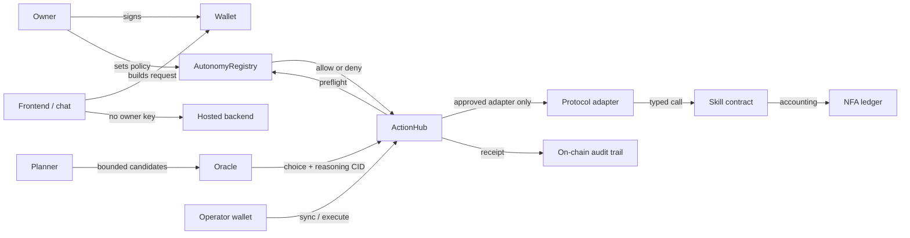

# Threat Model

Version: 1.0  
Last reviewed: 2026-09-16

This document describes the security boundaries of the live claworldnfa architecture. It focuses on the path from an owner or AI runtime to an on-chain state change:

`owner -> frontend -> wallet or operator -> oracle -> policy -> ActionHub -> adapter -> skill contract -> NFA ledger -> receipt`

It is a design and review guide. It is not an audit report and does not claim that every implementation defect has been found.

## 1. Protected Assets

The system protects:

- ownership and transfer control of each ClawNFA
- the Claworld balance recorded for each NFA in `ClawRouter`
- owner wallet funds used for mint, deposit, or direct transactions
- autonomous spending budgets and reserve floors
- task, PK, Battle Royale, market, upkeep, and withdrawal accounting
- oracle requests, resolved choices, execution status, and action receipts
- memory summaries and the learning-tree root anchored to an NFA
- operator, adapter, protocol, maintainer, pauser, and upgrade permissions
- hosted API keys, relayer keys, operator keys, bot tokens, and infrastructure credentials

## 2. Actors and Trust Assumptions

| Actor | Trusted for | Not trusted for |
| --- | --- | --- |
| NFA owner | approving user-initiated transactions and configuring autonomy | bypassing contract invariants or spending another NFA's balance |
| Browser frontend | presenting state, assembling calls, and requesting signatures | custody of user keys, final authorization, or authoritative chain state |
| Wallet | protecting the owner key and displaying a transaction for approval | validating project-specific economics or autonomy policy |
| Chat model | interpreting language and choosing among exposed actions | holding keys, inventing calldata, overriding budgets, or deciding final authorization |
| Hosted backend | model mediation, memory/runtime APIs, indexed reads, and bounded helpers | signing as the owner or bypassing on-chain checks |
| Autonomy planner | building and scoring bounded candidates | creating permissions that the owner did not grant |
| Oracle runner | fulfilling a request with one allowed choice and a reasoning reference | arbitrary contract execution or policy mutation |
| Operator wallet | submitting permitted autonomy lifecycle transactions | unrestricted access to NFA funds or arbitrary protocols |
| `AutonomyRegistry` | evaluating current approvals, limits, budgets, reserves, and breakers | deciding game outcomes or executing protocol-specific calldata |
| `ActionHub` | lifecycle state, policy preflight, adapter dispatch, spend validation, and receipts | replacing adapter or skill-level validation |
| Adapter | decoding one approved action family and calling its target skill | generic arbitrary calls or policy changes |
| Skill contract | enforcing gameplay, caller, accounting, settlement, and replay rules | trusting frontend or model claims without chain validation |
| Upgrade authority | deploying approved implementation upgrades | bypassing governance and operational review without creating systemic risk |

External RPCs, block explorers, price sources, IPFS gateways, wallets, model providers, Telegram, ClawHub, and hosting providers are availability or data dependencies. Their responses are not sufficient authorization for an on-chain state change.

## 3. Permission Boundary

### 3.1 Owner to wallet

User-initiated writes require a wallet signature. The frontend can propose a transaction, but it cannot approve it. A compromised frontend can present malicious calldata, so users still depend on wallet transaction review and contract-level access control.

Controls:

- no owner private key is stored in the repository or browser application
- chain ID and target contract are explicit
- skill contracts re-check ownership, caller, state, amount, and phase
- transaction hashes can be inspected on BscScan

### 3.2 Model to action card

Natural-language interpretation is an untrusted input layer. A model response can select or describe an action, but it is not authorization.

Controls:

- supported intents map to typed action cards
- wallet-confirmed paths still require the user signature
- autonomous paths use a candidate list and numeric choice rather than free-form calldata
- live chain reads and policy checks take precedence over model prose or memory

### 3.3 Planner to oracle

The planner reads current chain state, memory context, directives, and policy readiness. It builds deterministic candidates before asking a model to choose.

Controls:

- candidates are generated by code
- action kinds and protocols are finite
- maintenance actions can be prioritized before new risk-taking actions
- fallback behavior is deterministic when the model fails
- the prompt cannot grant permissions

### 3.4 Oracle to ActionHub

`ClawOracle` records a request and later resolves it to one bounded choice plus a reasoning reference. The oracle does not directly execute a skill contract.

Controls:

- request IDs and request status prevent ambiguous lifecycle reuse
- the resolved choice must fit the request's option range
- requests can expire
- fulfillment and execution are separate transactions
- reasoning content is evidence and context, not permission

### 3.5 Policy evaluation

`ClawAutonomyRegistry` is the primary authorization boundary for offline execution. Its evaluation path can deny an action based on independent controls.

Controls include:

- policy enabled state
- emergency pause
- operator approval
- adapter approval
- protocol approval
- action kind restrictions
- single-action spend cap
- daily action limit
- operator, asset, and protocol budgets
- minimum reserve and optional dynamic reserve source
- failure streak breaker
- lease/delegation state where configured

Policy is checked again before execution because approval, balance, reserve, or budget state can change after the oracle request was created.

### 3.6 ActionHub to adapter

`ClawOracleActionHub` owns the autonomy request lifecycle. It stores the requested action, syncs the oracle result, runs current policy preflight, dispatches only to the configured adapter, validates reported spend, and writes the receipt state.

Important controls:

- `capabilityHash` binds the request to a policy/capability snapshot
- oracle fulfillment does not imply successful execution
- the adapter address must match the registered action kind and policy
- `actualSpend` must not exceed the requested or authorized spend
- failed actions retain error and retry information
- cancel, execute, and finalize transitions are explicit

### 3.7 Adapter to skill contract

Adapters isolate protocol-specific decoding and calls. An adapter should expose one narrow action family, validate payload shape, and call a fixed target protocol.

Controls:

- adapter allowlisting in the registry
- action-kind-to-adapter wiring in the hub
- fixed protocol target or resolver rules
- typed payload decoding
- skill-level caller and state checks

An adapter must never become a generic arbitrary-call proxy.

### 3.8 Skill contract to NFA ledger

Task, PK, Battle Royale, market, mint, upkeep, deposit, and withdrawal contracts enforce their own state machines. The NFA internal balance is accounted for in `ClawRouter`.

Controls:

- NFA ownership and approved caller checks
- phase and timeout checks
- commit-reveal where front-running or hidden strategy matters
- exact ledger debit/credit paths
- settlement and claim replay protection
- reserve and withdrawal cooldown rules
- token transfer accounting separated from internal ledger accounting

## 4. Memory Boundary

Full CML memory can contain private or high-volume content and is kept off-chain. The chain stores only the learning-tree/root anchor when that path is used.

Security properties:

- memory text cannot grant wallet or autonomy permission
- memory can influence candidate scoring or conversational tone only within current policy
- a root update requires the authorized on-chain path
- memory API authentication and storage remain infrastructure concerns
- sensitive conversation content should not be placed in public reasoning documents or public storage by default

## 5. Receipt and Audit Boundary

An autonomous action receipt is evidence of lifecycle state, not proof that every off-chain statement was true. Reviewers should correlate:

- `requestId`
- `nfaId`
- action kind and protocol ID
- requester and executor
- requested and actual spend
- resolved choice
- payload, capability, result, and receipt hashes
- Claworld and XP credits
- reasoning CID when present
- retry count, timestamps, and last error
- target skill events and NFA ledger events

Reasoning documents uploaded to content-addressed storage are more inspectable than digest-only references. Either mode still depends on the on-chain lifecycle and policy checks for authorization.

## 6. Upgrade and Administration Risk

Upgradeable contracts and privileged roles are high-impact trust points.

Required operational controls:

- verify the current owner/admin before every upgrade
- compile and test the exact implementation being deployed
- inspect storage compatibility for UUPS upgrades
- publish implementation and proxy addresses
- use a dedicated upgrade script with explicit network and address checks
- retain emergency pause capability where supported
- prefer multisig or hardware-backed administration as the project matures
- do not store upgrade or operator keys in the repository, frontend, CI logs, or documentation

## 7. Primary Threats

| Threat | Boundary | Existing mitigation | Residual risk |
| --- | --- | --- | --- |
| Prompt or directive injection | user/memory -> model -> candidate | typed intents, finite candidates, wallet signature or registry policy | an injected prompt can still influence which permitted option is preferred |
| Malicious frontend | browser -> wallet | published addresses, wallet confirmation, contract access control | users may approve deceptive calldata if their wallet cannot explain it clearly |
| Compromised backend or model | API/model -> runtime | no owner key, bounded candidates, budgets, reserves, allowlists, breaker | it can disclose hosted data or repeatedly choose a harmful action that remains inside policy |
| Compromised memory store | memory -> planner/model | memory is context, not permission; chain state takes precedence | poisoned memory can bias conversation and candidate scoring |
| Compromised operator key | operator -> ActionHub | explicit approval, current policy preflight, spend and frequency limits | an attacker can consume the full remaining authorized budget until revoked or paused |
| Malicious oracle fulfillment | oracle -> ActionHub | bounded option range, lifecycle separation, policy re-check, receipts | the oracle can select the worst allowed option and publish misleading reasoning |
| Replay or stale oracle result | oracle lifecycle -> ActionHub | request status, expiry, explicit sync/execute transitions | lifecycle bugs or chain reorganization can still cause availability or reconciliation issues |
| Adapter misconfiguration | ActionHub -> adapter | registry approval, action wiring, typed interfaces, smoke tests | an approved but incorrectly configured adapter can route valid requests incorrectly |
| Malicious or generic adapter | adapter -> skill/external protocol | narrow interface, fixed target expectations, review, allowlist | an upgrade or newly approved adapter can expand authority beyond the reviewed model |
| Accounting mismatch | skill/token -> NFA ledger | settlement tests, event reconciliation, router accounting paths | token behavior, upgrade bugs, or untested edge cases can break conservation assumptions |
| Replay or double claim | skill state machine | claimed/finalized flags, phase checks, commit-reveal state | unreviewed new skills may introduce a separate replay surface |
| Stale market or chain data | RPC/indexer -> UI/runtime | on-chain execution checks; external data is advisory | users and planners can still make poor choices from incomplete or delayed information |
| Front-running and ordering | mempool -> protocol transaction | commit-reveal where secrecy matters, minimum/phase checks | public user actions without commit-reveal remain visible before inclusion |
| Upgrade or admin compromise | admin -> proxy/configuration | explicit upgrade scripts, storage review, published addresses, recommended hardware/multisig control | current privileged keys remain a systemic trust point until stronger governance is deployed |
| Secret leakage | repository/CI/logs -> attacker | ignored env files, server-only variables, review and rotation procedure | local machines and third-party hosting can still leak credentials outside repository controls |
| Denial of service | RPC/model/hosting/runner | retries, multiple RPC options, manual user path, fail-closed policy | agent continuity and automation remain dependent on external availability |

## 8. Invariants for Review and Testing

Security-sensitive changes should preserve these invariants:

1. A model response alone cannot move funds.
2. A user-initiated write requires the correct wallet authorization.
3. An autonomous write requires an approved operator, adapter, protocol, and action kind.
4. Current policy is checked at execution time, not only at request time.
5. Actual spend cannot exceed the authorized spend.
6. Reserve and daily budget controls fail closed.
7. Adapter payloads cannot become arbitrary external calls.
8. Skill contracts enforce their own state transitions and replay protection.
9. NFA ledger debits and credits reconcile with emitted events and settlement outcomes.
10. Full private memory is not published merely because a root or reasoning reference exists.
11. Upgrade authorization cannot be reached through the AI execution path.
12. Paused or breaker-tripped autonomy cannot continue executing new actions.

## 9. Security Test Expectations

Contract or runtime changes should include tests for the affected boundary:

- unauthorized owner/operator/adapter/protocol
- disabled and paused policy
- single, daily, asset, and protocol budget exhaustion
- reserve floor and dynamic reserve failure
- stale request, expired request, duplicate sync, duplicate execute, and duplicate finalize
- malformed payload and out-of-range oracle choice
- adapter target mismatch
- spend over-reporting and under-reporting
- failed execution and breaker progression
- commit/reveal timeout and settlement replay
- reward, burn, treasury, and NFA ledger reconciliation
- memory write authorization and root update authorization

## 10. Incident Response

When a credible issue affects funds or authorization:

1. pause the affected autonomy or protocol path when supported
2. disable the compromised operator, adapter, or protocol approval
3. preserve transaction hashes, request IDs, receipts, logs, and deployed bytecode
4. rotate exposed infrastructure credentials
5. reproduce on a fork before deploying a fix
6. review storage compatibility and migration impact
7. publish the affected addresses and remediation status
8. follow the private disclosure process in `SECURITY.md`

## 11. Out of Scope and Non-Claims

- The model is not assumed to be correct, aligned, or deterministic.
- A reasoning CID is not a guarantee that the reasoning is good.
- A verified source file is not proof that an upgradeable proxy currently points to that implementation.
- A frontend success message is not final settlement; chain state is authoritative.
- Public RPC, explorer, market, social, and token-risk data may be incomplete or stale.
- This document does not replace an independent smart-contract and infrastructure audit.

## 中文摘要

claworldnfa 的权限不是交给模型一把钥匙。用户操作由钱包签名；离线自治由 operator 发交易，但 operator 仍要经过 `AutonomyRegistry` 的预算、储备、次数、适配器、协议和熔断检查。Oracle 只能在候选项里返回选择，`ActionHub` 在执行前重新检查当前权限，再把固定格式的请求交给已批准的 adapter。adapter 只能调用对应 skill，skill 还要再次校验调用者、阶段、金额、结算和防重放条件。

完整记忆放在链下，链上只锚定学习树根。记忆和模型输出可以影响建议、排序和对话，但不能赋予钱包权限，也不能越过链上 policy。每次自治行为通过 request、choice、spend、result、reasoning CID 和 receipt 保留可审计记录。
